# Collision

This section covers collision ! Collision can be either :
* Assign to tiles / autotiles.
* Created from custom shapes in the **Asset Picker** window.

> 🐞 [Bug tracker here](https://trello.com/b/PIzgsYov/rpg-power-forge-road-map)

---
## Show / Hide collision in RPG Power Forge

At any point, you can toggle collision. Just click the **Markers** icon.

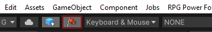

---
## Assign collisions to autotiles

If you already have placed tiles and props, your map could look like this.

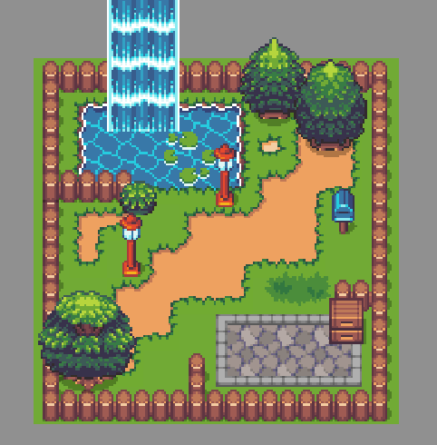

It needs collisions, overwise your character will move freely ! To do so, you can edit your tiles, located in *Assets/Project/Tiles*. Let's edit the default autotile **Tile Collection** by double-clicking it.

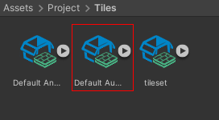

The **Tile Collection** edit window appears. Just select the "Wood Fence" autotile and click the [Generate Collisions] ☑️. Then, for this kind of autotile, choose *INNER* as the [Collision Type].

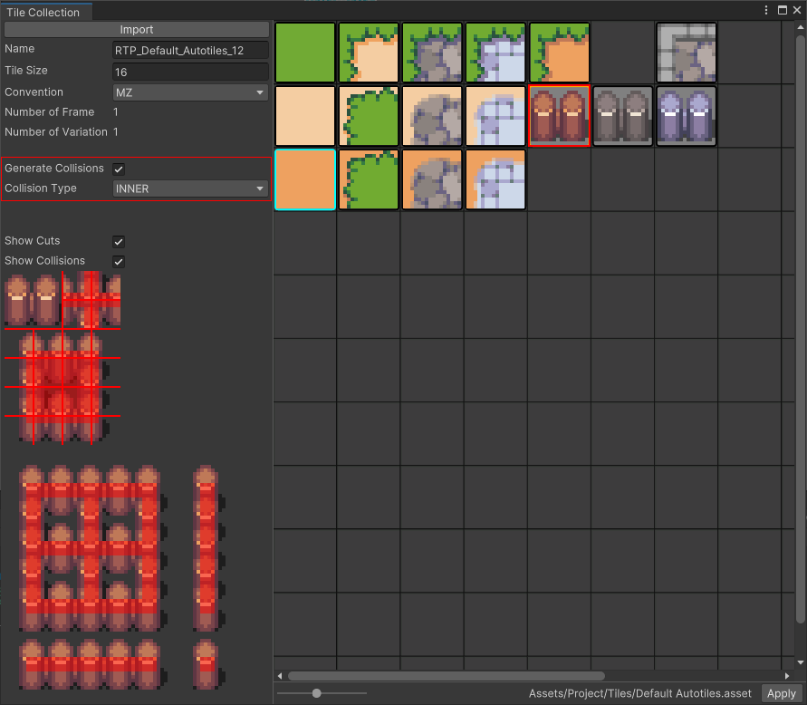

Collision Type|Function|
--------|--------
FULL|All of the tiles have collision
INNER|Only the inner part of the tiles (for fences).
OUTER|Only the outer part of the tiles.

> 🐲 Previews on the left side should help you set the collision as you want !

Once ready, select [Apply].

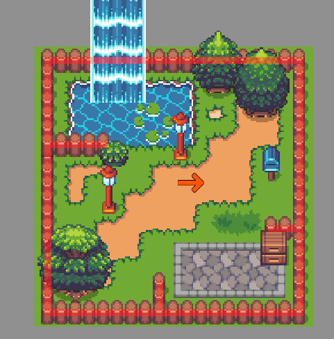

All of the fences autotiles now have collision applied. Congratulations ! 

---
## Assign collisions to tiles

Like autotiles, you can assign collision to single tiles you have imported. Let's take a look at our tileset we have imported in a previous section. Double-click on the **Tile Collection** named *tileset*.

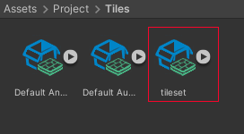

The **Tile Collection** edit window appears. Just select the "cut tree" tile and click the [Generate Collisions] ☑️. Then, for this kind of tile, choose *FULL* as the [Collision Type].

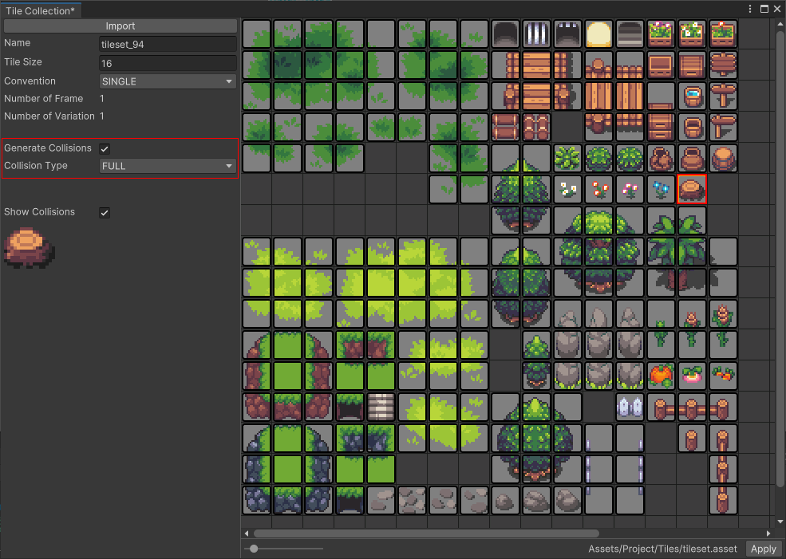

Once ready, select [Apply]. Now everytime you will draw this tile on a layer, the collision will be applied.

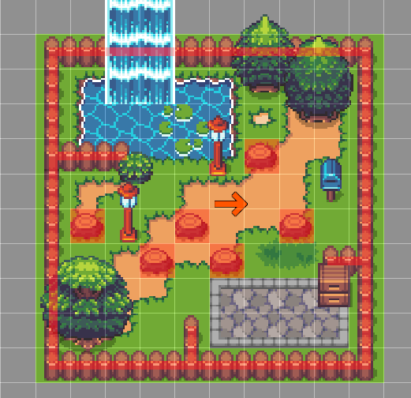

---
## Asset Picker Window

If needed , you can add custom collision shapes on your map. Just open the **Asset Picker** window.

Select the [Colliders] category and choose a shape.

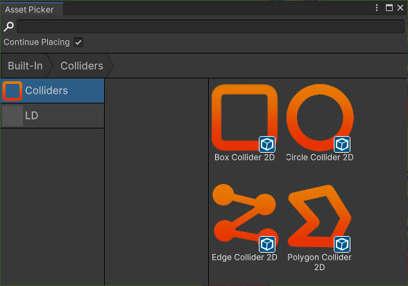

Collider shape|Function|
--------|--------
Box|Rectangle shape
Circle|Circle shape
Edge|Line shape. You add and remove points on it
Polygon|Custom polygon shape

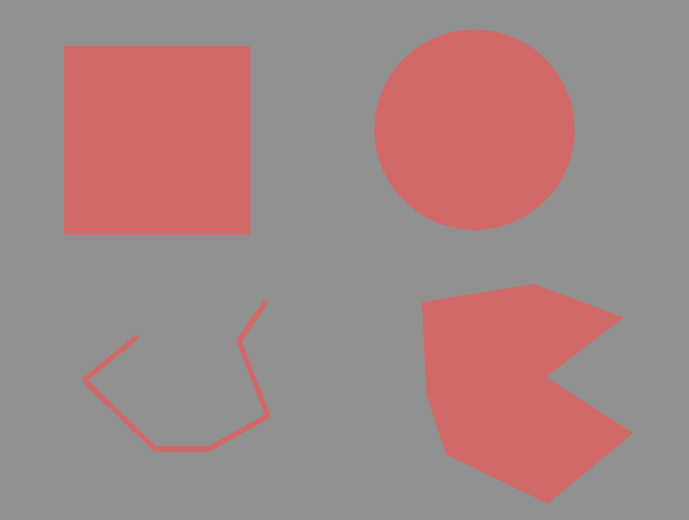

> 🐲 Once placed on a map, colliders shapes can be edited and moved by directly clicking them ! Don't forget to select the **Move tool** from the tools bar.

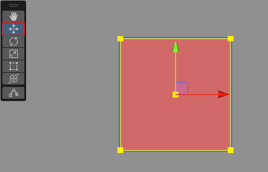

Now our map is playable !

