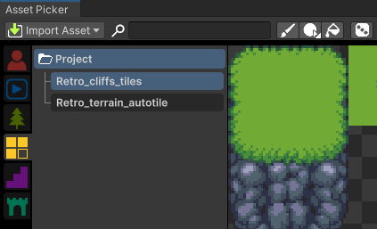
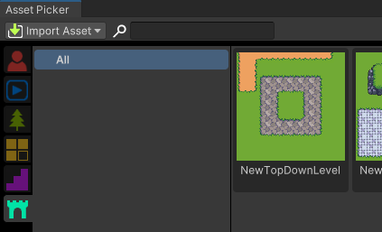

# Assets Picker

This section covers the RPG Power Forge feature : Assets Picker !

```admonish success title="Oh yeah"
This section is up-to-date !
```


## Summary

## Feature definition
```admonish summary title="Assets Picker"
The Assets Picker is one of the main feature of RPG Power Forge. With it, you can import, browse, organize, edit, drag and drop multiple different kind of prefabs on the Scene directly from it !
```

## Feature location

### From the Tool Bar


## Feature details

The Assets Picker has a few sections :


 1. **Tool bar** : context-sensitive tools, quick search and import.
 1. **Assets Categories** : Asssets are arranged in categories (Actors, Tiles, Scenes, ...)
 1. **Category hierarchy** : Assets of the same category can be arranged into collections or folders.
 1. **Preview** : available Assets in the selected collection / folder.

### Quick import
You can import more assets from the dedicated drop-down menu :


### Actors
Actors are the living assets of your game : Playable or non-playable characters, elements to interact with, enemies, etc.


### Animations
Animations are the animated spritesheets you have imported in your project. They are the building blocks to create Actors.


### Props
Props are all of the assets (animated or not) that populate your Scene : Trees, houses, barrels, etc. They have a collider attached.


### Tiles
Tiles are all of the terrain textures (animated or not) you can place on the grid. They have a collider attached.



### Built-in
Built-in are all of the elements we have crafted so you can make you Scene easier : stairs to change height, doors to be transported to another Scene, custom colliders, ...


### Scenes
All of the Scenes of your project you can go to, edit or remove.
