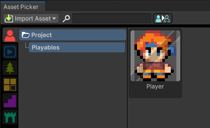

# Assets Picker

This section covers the RPG Power Forge feature : Assets Picker !

```admonish warning title="🛠️"
Working on it !
```

## Summary

## Feature definition
```admonish summary title="Assets Picker"
The Assets Picker is one of the main feature of RPG Power Forge. With it, you can import, browse, organize, edit, drag and drop multiple different kind of prefabs on the Scene directly from it !
```

## Feature location

### From the Tool Bar


## Feature details

### Pick Actors
Actors are the living assets of your game : Playable or non-playable characters, elements to interact with, enemies, etc.


### Pick 2D Props
Props are all of the assets that populate your Scene : Trees, houses, barrels, etc.


### Pick Tiles

### Pick Built-in prefabs

### Pick Animations

### Pick Scenes
