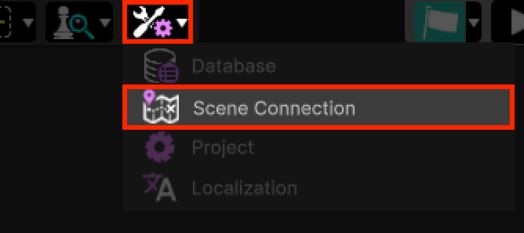
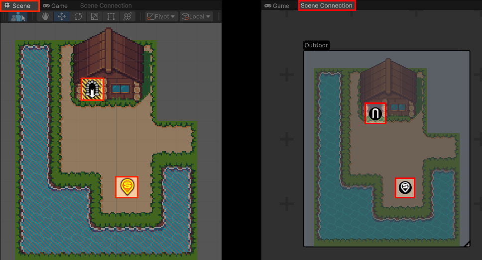
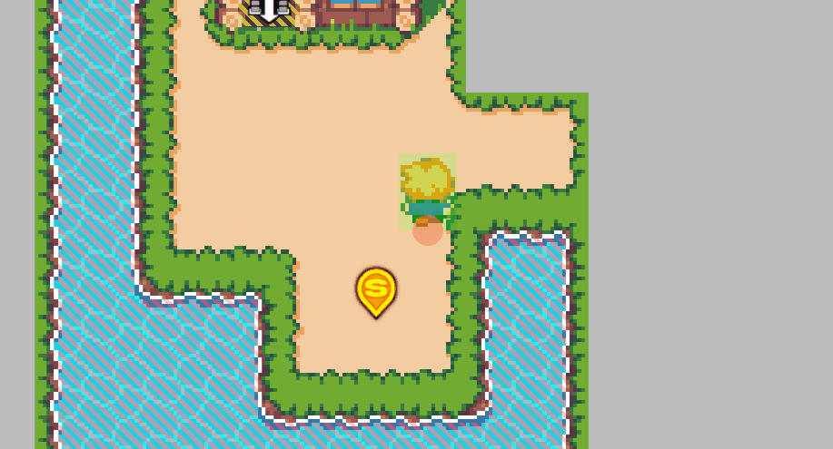

# Scene Connection
This section covers the RPG Power Forge feature : Scene Connection !

```admonish warning title="I'm on it..."
This section is in work-in-progress ! 
```

## Summary

## Feature definition
```admonish summary title="Scene Connection"
The Scene Connection feature allows you to overview all of your scenes and connect them together through teleport points.
```


## Feature location

### From the Tool Bar



## Feature overview

The feature has a dedicated window, where you can see all of your Scenes. The example below has 2 Scenes : Outdoor and Indoor.


Each Scene contains a preview of the Scene as well as all of its **teleport points**. A **teleport point** is nothing more than a spawn point or a door for example. When you place a **teleport point** on your Scene, you will see it in the **Scene connection** window :



You can connect **teleport points** together by pressing and holding the left mouse :


Now your Scenes are connected together, congratulations !

