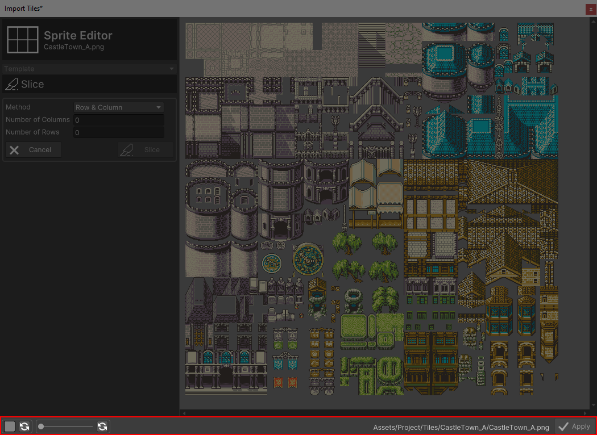

# Status Bar

This section covers the RPG Power Forge feature : Status Bar !

```admonish success title="Oh yeah"
This section is up-to-date !
```

## Summary

## Feature definition
```admonish summary title="Status Bar"
The Status Bar gives you access to most of the features to make a great RPG game, from importing assets to shipping your game online.
```

## Feature location

The Status Bar is located at the bottom of each RPG Power Forge window :



## Feature details

Icon | Title | Functionnality
---|---|---
 | Back | Go back to the previous window (if any). You'll be prompted if you have unsaved changed.
 | Background color | Edit background color (and revert to default) when you need to have a better contrast on your assets.
 | Scale view | Scale the assets view (and revert to default) for a closer look.
 | Apply | Save your modifications and close the window (or go to the next one, if any).

