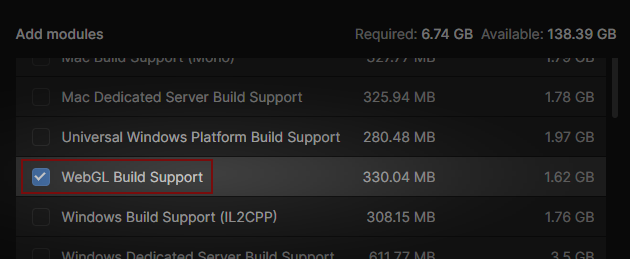

# Download

This section covers the elements to download :
1. **Unity Hub** to manage Unity versions and your projects list.
1. **Unity** latest version 2021.3
1. **RPG Power Forge** is the Unity package to install with Unity.

## Download Unity Hub

Go to https://unity.com/download. This page will ask you to download the Unity Hud. Once installed on your computer, launch it.

## Download Unity

Unity has many versions. To easily download and switch versions, the Unity Hub comes in handy. With the Unity Hub installed and opened, select [Installs].

Then select [Install Editor]

Choose the last Unity 2021.3 version (recommended). In this example, this is the version 2021.3.25f1.

Before runnig the download + installation, select the additionnal WebGL Build Support (to be able to export your projects in WebGL, usefull for itch.io for example). If not, it is always possible to download it later.

Once you have clicked [Install] you can see the download and installation progress in the Unity Hub.

## Download RPG Power Forge

If you have access to the early-access of this package, then we have gave you the download link already. By now you should have downloaded a .unitypackage.

