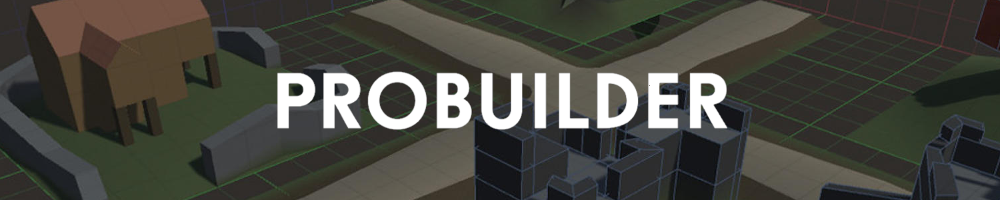

# Packages dependencies

```admonish tip title="Oh yeah"
This section is up-to-date with RPG Power Forge v0.0.24 !
```

## Summary

## Introduction
RPG Power Forge comes with some packages dependencies listed below. Thanks to these, your gamedev experience is even more pleasant !

```admonish note title="Easy-peazy"
Dependencies are automatically downloaded and installed during RPG Power Forge package installation. You don't have to do anything !
```

## Aseprite importer

Aseprite Importer is a free Unity package which enables the import of .aseprite files from the Pixel Art tool Aseprite.

This package is included in RPG Power Forge to import these files directly in Unity and automatically create ?Animation Collection?.

[Official documentation](https://docs.unity3d.com/2021.3/Documentation/Manual/com.unity.2d.aseprite.html)

[Aseprite website](https://www.aseprite.org/)

## Probuilder

Probuilder is a free Unity package which enables the creation of 3D objects in Unity with a set of simple tools and commands.

*currently in RPG Power Forge integration stage*


[Official documentation](https://docs.unity3d.com/Packages/com.unity.probuilder@4.0/manual/index.html)

[Offical tutorials](https://www.youtube.com/user/Unity3D/search)