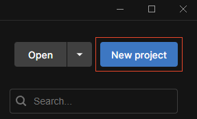

# Create a new project

This section covers the creation of a new Unity project with RPG Power Forge !

```admonish tip title="Oh yeah"
This section is up-to-date for Unity 2022.3 !
```

## Summary

## Create a new Unity project

To create a new project, [[open the Unity Hub]] and [[select "Project"]], from the left panel (should be selected by default).


[[Select "New project"]] on the top-right corner.



On the setting page, [[mind the steps]] :
1. Check the Unity version you are using (we recommend the last **Unity 2021.3**)
1. Select the "2D Core" template
1. Fill the project name and location
1. Click "Create project"


Well done ! The project is loading for the first time...


Once loaded, the project will open. Congratulation, you now have a new Unity project set up !


## Import RPG Power Forge

RPG Power Forge is a Unity package (file with the ".unitypackage" extension). To import a Unity package, [[choose Assets > Import Package > Custom Package]]. A file browser appears, prompting you to locate the .unitypackage file.


In the file browser, [[select the RPG Power Forge Unity package file]] and click Open. Then, Unity will inform you the package you want to install will overwrite the current project setting : it's perfectly normal ! [[select "Import"]].


A new window will display all the items to install. Make sure everything is selected (should be by default) and [[select "Import"]].


RPG Power Forge package is now importing !


RPG Power Forge will ask you if you are OK to install it. [[select "Install"]].


RPG Power Forge package is installing ! Unity will restart upon completion.


## Congratulations !

Well done, Unity Editor now has RPG Power Forge installed ! Make sure you have a new drop-down menu in the top bar, named "RPG Power Forge".


You can now [start making games here]() !
