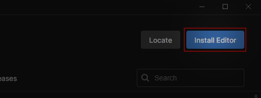
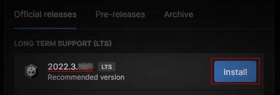
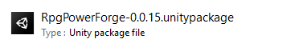

# Download

This section covers the download procedure in order to use RPG Power Forge.

```admonish
A plain note.
```

```admonish example
My example is the best!
```

```admonish warning title="Data loss"
The following steps can lead to irrecoverable data corruption.
```

```admonish tip title="_Referencing_ and <i>dereferencing</i>"
The opposite of *referencing* by using `&` is *dereferencing*, which is
accomplished with the <span style="color: hotpink">dereference operator</span>, `*`.
```

~~~admonish bug
This syntax won't work in Python 3:
```python
print "Hello, world!"
```
~~~

> 🐞 [Bug tracker here](https://trello.com/b/PIzgsYov/rpg-power-forge-road-map)

## Summary

## Recommendations
Software | Version |
--- | --- 
Unity Hub | >= 3.4
Unity | 2021.3
RPG Power Forge | last stable

## Install Unity Hub

The Unity Hub is a launcher and manager for Unity versions and projects.

[[Go to the Unity website]] : [unity.com/download](https://unity.com/download). This page will ask you to download the Unity Hub.

Once installed on your computer, [[launch it]]. The Unity Hub version is diplayed in the top-left window corner :


## Install Unity

With the Unity Hub installed and opened, [[select "Installs"]] :


Then [[select "Install Editor"]] :



[[Select Unity 2021.3]] (recommended version). In this example, this is the version 2021.3.25f1 :



### Additional Unity packages

For a greater experience, we recommend to also select the following packages when installing Unity.

#### WebGL Build Support (optional)

This package allows Unity to build WebGL projects, which is used to publish games on itch.io. [[Select the package "WebGL Build Support"]] :


### Start the Unity installation

Once you have chosen your packages, [[select "Install"]] :


You can now see the download and installation progress in the Unity Hub left panel.


## Download RPG Power Forge

If you have access to the early-access of this package, then we have given you the download link already. By now you should have downloaded a .unitypackage file :




## Create a new project

You are noew ready to make games ! [[Create a new project]] : [Your first 2D project !](./new_project.md)

{{#include ./../glossary.md}}
