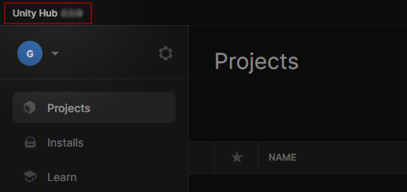
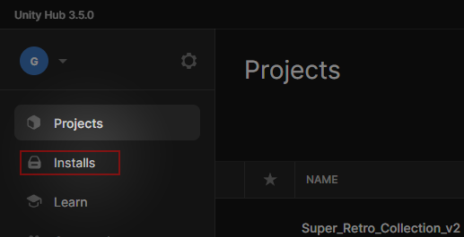
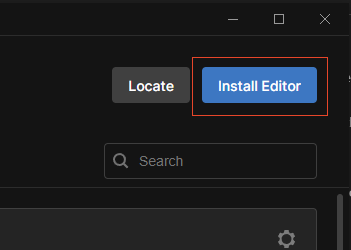
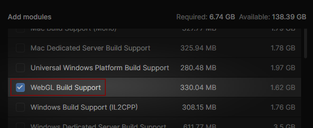
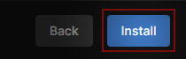
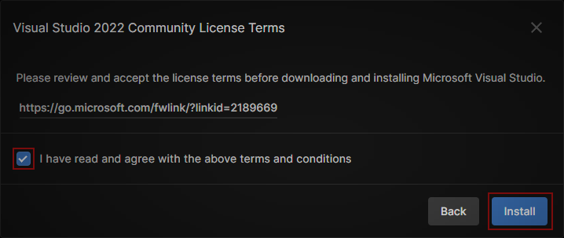
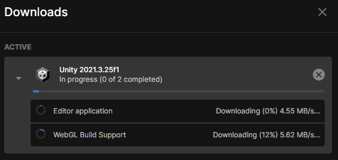
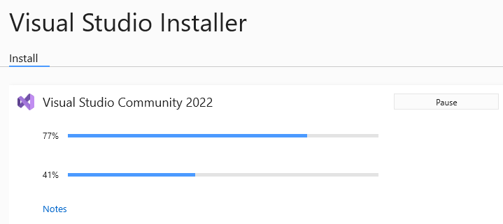

# Install Unity

This section covers the download and installation process for Unity Hub and Unity Editor.

```admonish success title="Oh yeah"
This section is up-to-date with Unity 2022.3 !
```

## Summary

## Recommendations
Software | Version |
--- | --- 
Unity Hub | >= 3.4
Unity | 2022.3
Visual Studio | Community 2022

## Install Unity Hub

```admonish summary title="Unity Hub"
The Unity Hub is a standalone application that streamlines the way you find, download, and manage your Unity Projects and installations.
```

[[Go to the Unity website]] : [unity.com/download](https://unity.com/download). This page will ask you to download the Unity Hub.

Once installed on your computer, [[launch it]]. The Unity Hub version is diplayed in the top-left window corner :



## Install Unity Editor

With the Unity Hub installed and opened, [[select "Installs"]] :



Then [[select "Install Editor"]] :



[[Select Unity 2022.3]] (recommended version). In this example, this is the version 2022.3.15f1 :


### Additional Unity packages

For a greater experience, we recommend to also select the following packages when installing Unity.

```admonish question title="What if I don't want to install additionnal things now ?"
You can also skip this section and install packages later on. [[Jump to]] [Start the Unity installation](#start-the-unity-installation) !
```

#### WebGL Build Support (optional)

This package allows Unity to build WebGL projects, which is used to publish games on itch.io. [[Select the package "WebGL Build Support"]] :



### Start the Unity installation

Once you have chosen your packages, [[select "Install"]] :



If asked, please accept the Visual Studio 2022 Community Licence Terms. [[Check the box]] and [[select "Install"]]:



You can now see the download and installation progress in the Unity Hub left panel.



### Install Visual Studio Community

During the installation process, Visual Studio Community 2022 will install automatically.

```admonish summary title="Visual Studio Community"
Visual Studio Community is a powerful developer tool that you can use to write, edit, debug, and build code in your Unity projects. The installation is not mandatory but recommended for a better gamedev experience.
```

The installation will happend in a dedicated window. You may be asked to restart your computer at the end of the process.



## Congratulations

You have the Unity Editor installed on your computer ! You can now [download RPG Power Forge here](./download_rpg_power_forge.md).