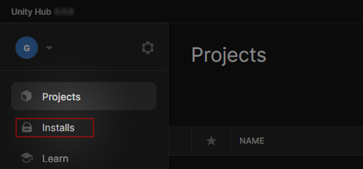
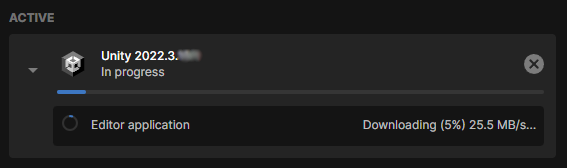

# Install Unity

This section covers the download and installation process for Unity Hub and Unity Editor.

```admonish tip title="Oh yeah"
This section is up-to-date !
```

## Summary

## Recommendations
Software | Version |
--- | --- 
Unity Hub | >= 3.4
Unity | 2021.3

## Install Unity Hub

```admonish title="What is the Unity Hub ?"
The Unity Hub is a standalone application that streamlines the way you find, download, and manage your Unity Projects and installations.
```

[[Go to the Unity website]] : [unity.com/download](https://unity.com/download). This page will ask you to download the Unity Hub.

Once installed on your computer, [[launch it]]. The Unity Hub version is diplayed in the top-left window corner :


## Install Unity Editor

With the Unity Hub installed and opened, [[select "Installs"]] :



Then [[select "Install Editor"]] :


[[Select Unity 2021.3]] (recommended version). In this example, this is the version 2021.3.25f1 :


### Additional Unity packages

For a greater experience, we recommend to also select the following packages when installing Unity.

```admonish
You can also skip this part and install packages later on.
```

#### WebGL Build Support (optional)

This package allows Unity to build WebGL projects, which is used to publish games on itch.io. [[Select the package "WebGL Build Support"]] :


### Start the Unity installation

Once you have chosen your packages, [[select "Install"]] :


You can now see the download and installation progress in the Unity Hub left panel.




## Congratulations !

Now you have the Unity Editor installed on your computer. You can now download  [RPG Power Forge here](./installation/download_rpg_power_forge.md).