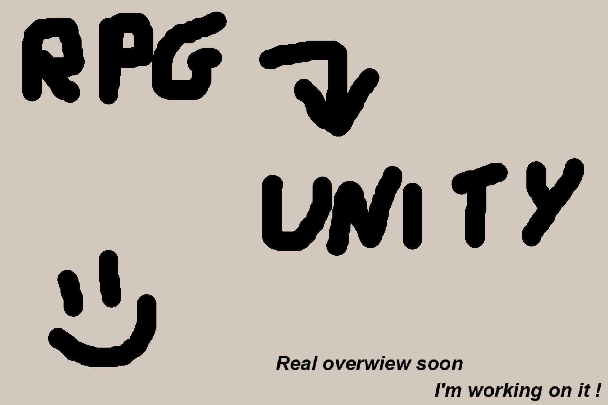

# Introduction

Welcome to the installation process ! Please take a look a the following steps.

```admonish warning title="Working on it..."
Almost done !
```

## Summary

## Overview



## Detailled steps

### Unity Hub + Unity Editor
```admonish example title="Detailled process"
Unity Hub is a standalone application to manage all of your Unity Projects and installations.
Unity Editor is the game developpement engine we are using to run RPG Power Forge.

Installation process [is detailled here](./installation_unity.md).
```

### RPG Power Forge
```admonish example title="Detailled process"
RPG Power Forge is our product : it's a Unity package designed to make RPG games.

Download process [is detailled here](./download_rpg_power_forge.md).
```

### Create a new project
```admonish example title="Detailled process"
Create a new RPG Power Forge project in Unity to complete the installation !

Creation process [is detailled here](./create_new_project.md).
```