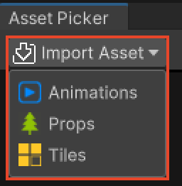
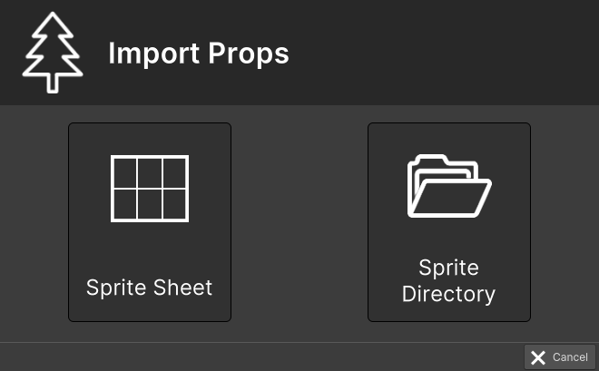

# Assets Importer

This section covers the RPG Power Forge feature : Assets Importer !

```admonish warning title="🛠️"
Working on it !
```

## Summary


## Window location

### From the Assets Picker



### From the Tool Bar
*working on it*

## Window content

### Import Animations


Import option|Description|Supported formats
--------|--------|--------
Sprite Sheet|Import an image file made up of numerous smaller graphics ("sprites") that are grouped into a tiled grid formation.|.png .bmp .jpg .jpeg
Sprite Directory|Import a folder containing one or multiple sprites, each separated in its own image file|folders and subfolders
Aseprite File| Import an Aseprite file that already contain animation information|.ase .aseprite

```admonish example title="Detailled process"
Import process [is detailled here](./assets_importer/import_animations.md).
```

### Import Props



Import option|Description|Supported formats
--------|--------|--------
Sprite Sheet|Import an image file made up of numerous smaller graphics ("sprites") that are grouped into a tiled grid formation.|.png .bmp .jpg .jpeg
Sprite Directory|Import a folder containing one or multiple sprites, each separated in its own image file|folders and subfolders

```admonish example title="Detailled process"
Import process [is detailled here](./assets_importer/import_props.md.md).
```

### Import Tiles


Import option|Description|Supported formats
--------|--------|--------
Sprite Sheet|Import an image file made up of numerous smaller graphics ("sprites") that are grouped into a tiled grid formation.|.png .bmp .jpg .jpeg
Sprite Directory|Import a folder containing one or multiple sprites, each separated in its own image file|folders and subfolders

```admonish example title="Detailled process"
Import process [is detailled here](./assets_importer/import_tiles.md).
```