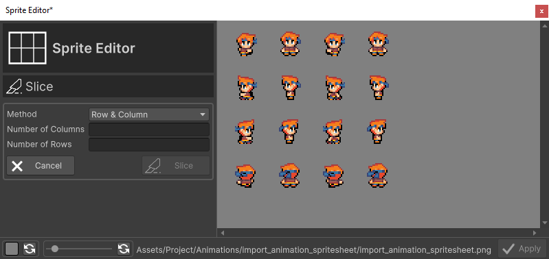
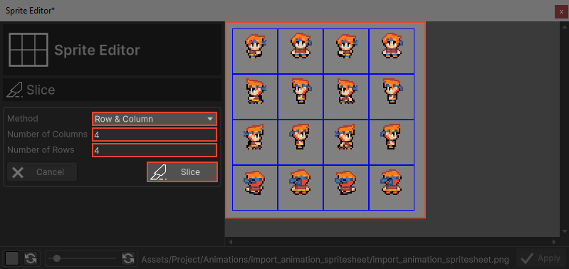
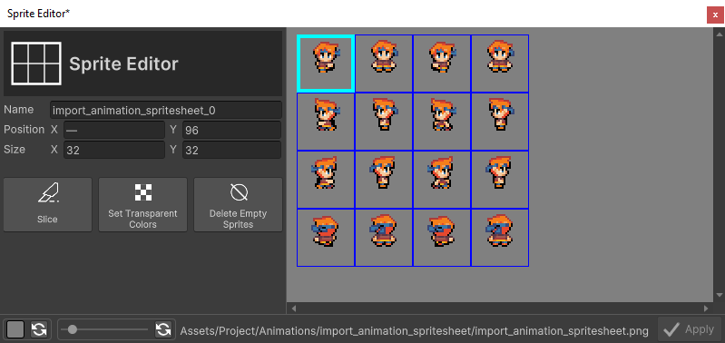
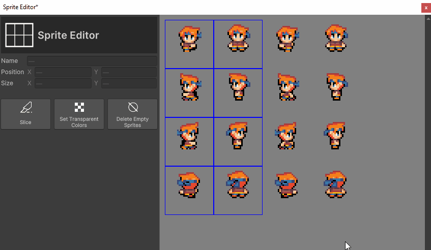
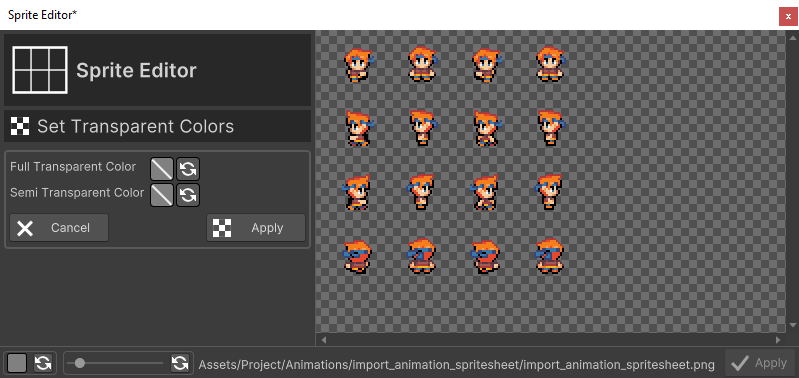
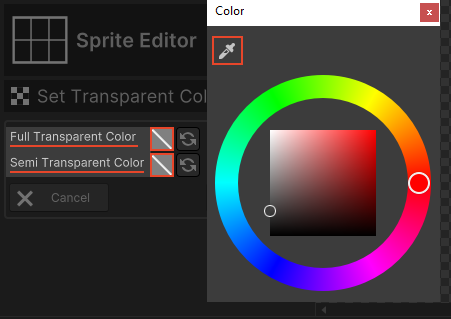
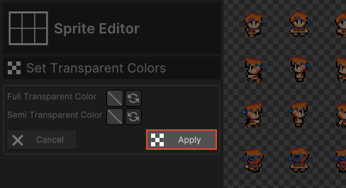
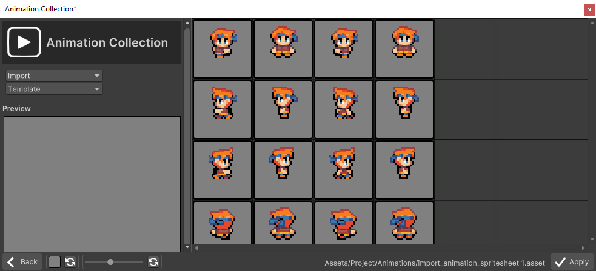
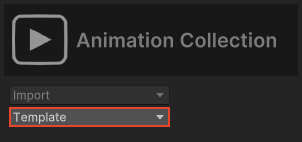

# Import Animations

This section covers the import of Animations with RPG Power Forge !

```admonish warning title="🛠️"
Working on it !
```

## Summary

## Window location

```admonish example title="Window location"
Detailled location are in [Assets Importer page here](./assets_importer.md#feature-location).
```

## Window content


Import option|Description|Supported formats
--------|--------|--------
Sprite Sheet|Import an image file made up of numerous smaller graphics ("sprites") that are grouped into a tiled grid formation.|.png .bmp .jpg .jpeg
Sprite Directory|Import a folder containing one or multiple sprites, each separated in its own image file|folders and subfolders
Aseprite File| Import an Aseprite file that already contain animation information|.ase .aseprite

## Import procedure

### Sprite Sheet

Let's import this sample sprite sheet (a character walking in 4 directions) :


```admonish tip title="User manual resources :import_animation_spritesheet.png"
You can download all of our tutorial resources here : [download user_resources.zip file](https://rpgpowerforge.com/media/user_resources.zip)
```

#### Import the Sprite Sheet file
[[Select the Sprite Sheet button]] and choose the file to import in your file browser.


#### Sprite Sheet edition window
The Sprite Sheet is imported into our Sprite Editor :


#### Slice the Sprite Sheet
A Sprite Sheet is usually composed of multiple Sprites arranged in a grid, like our current sample. We can slice the Sprite Sheet into individual Sprites with the Slice function. [[Select the Slice button]] :


You can Slice a Sprite Sheet with 2 methods :

Slice method|Description
--------|--------
Row & Column | Slice according to a number of rows and columns.
Pixel Size | Slice according to X and Y individual Sprite size (width and height).

Everytime you change a value, the slice preview will update (blue grid). 

[[Select the Slice button]] once the preview match your desire.  



You are redirected to the main Sprite Editor screen :



#### Delete Sprites (optional)

It is possible to remove unnecessary Sprites. 2 methods :
 * **Automatic** : if the Sprite is empty, you can [[Select the Delete Empty Sprites button]] to remove all of the empty Sprites at once.
 * **Manual** : if the Sprite is not empty, you can :
     * For a single sprite : 
       * Select the Sprite
       * Right-click > [[Delete]].
     * For multiple sprites (rectangle selection): 
        * Select the first Sprite
        * Select the last Sprite (while holding SHIFT key)
        * Right-click > [[Delete]].

Here is an example of multiple Sprites deletion with SHIFT key.


```admonish question title="Help, I need to undo !"
No problemo, [[press CTRL + Z]] to undo last action:

```

#### Transparency colors (optional)

```admonish note title="Good to go"
Our current Sprite Sheet example doesn't need additional transparency settings, so you can skip this section if you are using it. Next section is [Validate the Sprite Sheet](./import_animations.md#validate-the-sprites-sheet) !
```


If necessary, you can define transparency colors for the Sprites. [[Select the Set Transparency button]].



You can pick 2 different colors :
 * One for **full transparency** (useful if you want to remove a background color). The color will be completely transparent.
 * One for **semi-transparency** (useful for shadow, glass, tall-grass, etc.). The color will be half-transparent.

In both cases, we recommend to use the **Color Picker** to select the desired color precisely on the Sprite Sheet.



When you are satisfied with the results, [[Select the Apply button]]. You will be redirected to the main Sprite Editor screen.



### Validate the Sprite Sheet

You are now ready to go ! [[Select the Apply button]] in the bottom-right corner to go to the Animation creation !


## Create Animations

Welcome to the Animations Collection ! This editor will help you create animation easily !

```admonish example title="Animations Collection window content"
Please refer to the [detailled window content here](./../collections/animations_collection.md#window-content).
```

All of your Sprites are now sliced and can be used to create an Animation !



### Manual creation

You can create an animation manually :
* Select the first Sprite
* Select the last Sprite (while holding SHIFT key)
* Right-click > [[Create Animation]]


### Automatic creation

RPG Power Forge comes with various way to create multiple Animations at once. All of these are under the Template dropdown :



#### One animation per line of Sprites


