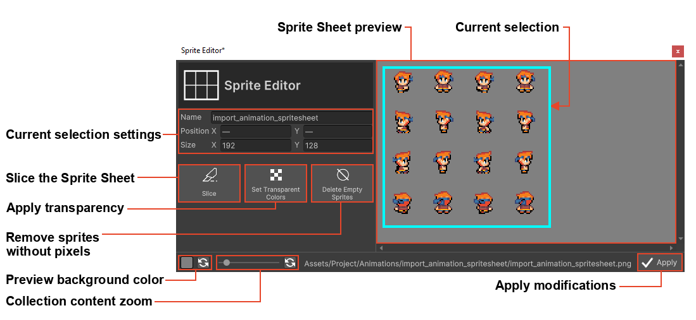
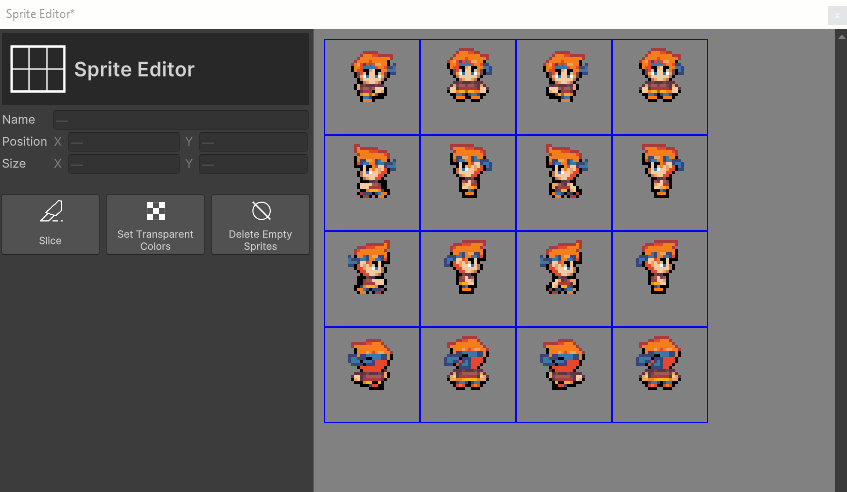

# Import Animations

This section covers the import of Animations with RPG Power Forge !

```admonish warning title="🛠️"
Working on it !
```

## Summary

## Window location

```admonish example title="Window location"
Detailled location are in [Assets Importer page here](./assets_importer.md#feature-location).
```

## Window content


Import option|Description|Supported formats
--------|--------|--------
Sprite Sheet|Import an image file made up of numerous smaller graphics ("sprites") that are grouped into a tiled grid formation.|.png .bmp .jpg .jpeg
Sprite Directory|Import a folder containing one or multiple sprites, each separated in its own image file|folders and subfolders
Aseprite File| Import an Aseprite file that already contain animation information|.ase .aseprite

## Import procedure

### Sprite Sheet

Let's import this sample sprite sheet (a character walking and attacking in 4 directions) :


```admonish tip title="User manual resources :import_animation_spritesheet.png"
You can download all of our tutorial resources here : [download user_resources.zip file](https://rpgpowerforge.com/media/user_resources.zip)
```

#### Import the sprite sheet file
[[Select the Sprite Sheet button]] and choose the file to import in your file browser.


#### Sprite Sheet edition window
The Sprite Sheet is imported into our Sprite Editor :



#### Slice the Sprite Sheet
A Sprite Sheet is usually composed of multiple Sprites arranged in a grid, like our current sample. We can slice the Sprite Sheet into indivisual Sprites with the Slice function. [[Select the Slice button]] :


Slice method|Description
--------|--------
Row & Column | Slice according to a number of row and columns
Pixel Size | Slice according to X and Y individual Sprite size.

Everytime you change method or fields values, you will see an updated preview of the slice (blue grid).


[[Select Slice]] once the preview match your desire. You will go back to the main window of the Sprite Editor :


#### Delete Sprites

It is possible to remove unnecessary Sprites. 2 methods :
 * if the Sprite is empty, you can [[Select the Delete Empty Sprites button]] to remove all of the empty Sprites at once.
 * if the Sprite is not empty, you can :
     * For a single sprite : select it + right-click > [[Delete]].
     * For multiple sprites : select multiple with left-click + SHIFT key, then right-click > [[Delete]].




```admonish example title="Oops, I need to undo"
No problemo, [[press CTRL + Z]] to undo last action :

```
