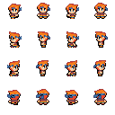

# Import Animations

This section covers the import of Animations with RPG Power Forge !

```admonish warning title="🛠️"
Working on it !
```

## Summary

## Window location

```admonish example title="Window location"
Detailled location are in [Assets Importer page here](./assets_importer.md#feature-location).
```

## Window content


Import option|Description|Supported formats
--------|--------|--------
Sprite Sheet|Import an image file made up of numerous smaller graphics ("sprites") that are grouped into a tiled grid formation.|.png .bmp .jpg .jpeg
Sprite Directory|Import a folder containing one or multiple sprites, each separated in its own image file|folders and subfolders
Aseprite File| Import an Aseprite file that already contain animation information|.ase .aseprite

## Import procedure

### Sprite Sheet

Let's import this sample Sprite Sheet (a character walking in 4 directions) :



```admonish tip title="User manual resources"
You can download all of our tutorial resources here : [download user_resources.zip file](https://rpgpowerforge.com/media/user_resources.zip)
```

#### Import the Sprite Sheet file
[[Select the Sprite Sheet button]] and choose the file to import in your file browser.


#### Sprite Sheet editor window
The Sprite Sheet is imported into our Sprite Editor :


#### Slice the Sprite Sheet
A Sprite Sheet is usually composed of multiple Sprites arranged in a grid, like our current sample. We can slice the Sprite Sheet into individual Sprites with the Slice function :


#### Delete Sprites (optional)

It is possible to remove unnecessary Sprites (empty or not wanted). Deleted Sprites won't be imported in your RPG Power Forge project.

Delete method|Description
--------|--------
Automatic|[[Select the "Delete Empty Sprites" button]] to remove all of the empty Sprites at once. To undo, [[press CTRL + Z]].
Manual|[[Select the Sprite, right-click > Delete]]. Additionnally, you can select multiple Sprites with the SHIFT key. To undo, [[press CTRL + Z]].


#### Transparency colors (optional)

You can define transparency colors for the Sprites. You can pick 2 different colors :

Transparency method|Description
--------|--------
Full Transparent Color| Useful if you want to remove a background color from your Sprite Sheet. The selected color will be completely transparent.
Semi Transparent Color| Useful for shadow, glass, tall-grass, etc. The selected color will be half-transparent.

In both cases, we recommend to use the **Color Picker** to select the desired color precisely.


### Validate the Sprite Sheet

You are now ready to go ! [[Select the "Apply" button]] in the bottom-right corner to go to the Animation creation !


## Create Animations

Welcome to the Animations Collection ! This editor will help you create animation easily !

```admonish example title="Animations Collection window content"
Please refer to the [detailled window content here](./../collections/animations_collection.md#window-content).
```

All of your Sprites can be used to create an Animation !

### Manual creation

You can create an animation manually :
* [[Select the first Sprite]]
* [[Select the last Sprite (while holding SHIFT key)]]
* [[Right-click > Create Animation]]


### Automatic creation

RPG Power Forge comes with various way to create multiple Animations at once. All of these are under the Template dropdown :

#### One animation per line of Sprites


#### RPG Maker Character templates

You can import your assets that follow RPG Maker templates and automatically create animations from them.

With our sample, we use the RPG Maker XP Character template :


Here's another example, using the RPG Maker MV/MZ Vertical template (chests and doors, mostly) :


```admonish tip title="User manual resources"
You can download all of our tutorial resources here (including all RPG Maker templates): [download user_resources.zip file](https://rpgpowerforge.com/media/user_resources.zip)
```