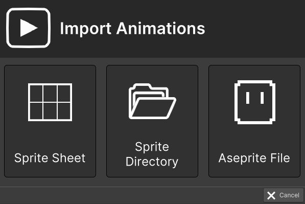

# Import Animations

This section covers the import of Animations with RPG Power Forge !

```admonish warning title="🛠️"
Working on it !
```

## Summary


## Window content


Import option|Description|Supported formats
--------|--------|--------
Sprite Sheet|Import an image file made up of numerous smaller graphics ("sprites") that are grouped into a tiled grid formation.|.png .bmp .jpg .jpeg
Sprite Directory|Import a folder containing one or multiple sprites, each separated in its own image file|folders and subfolders
Aseprite File| Import an Aseprite file that already contain animation information|.ase .aseprite
