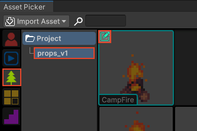
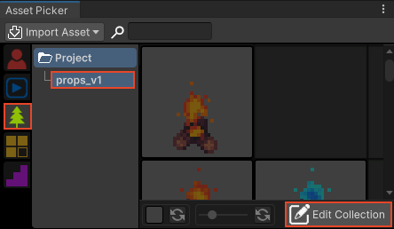
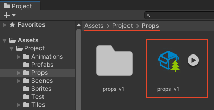
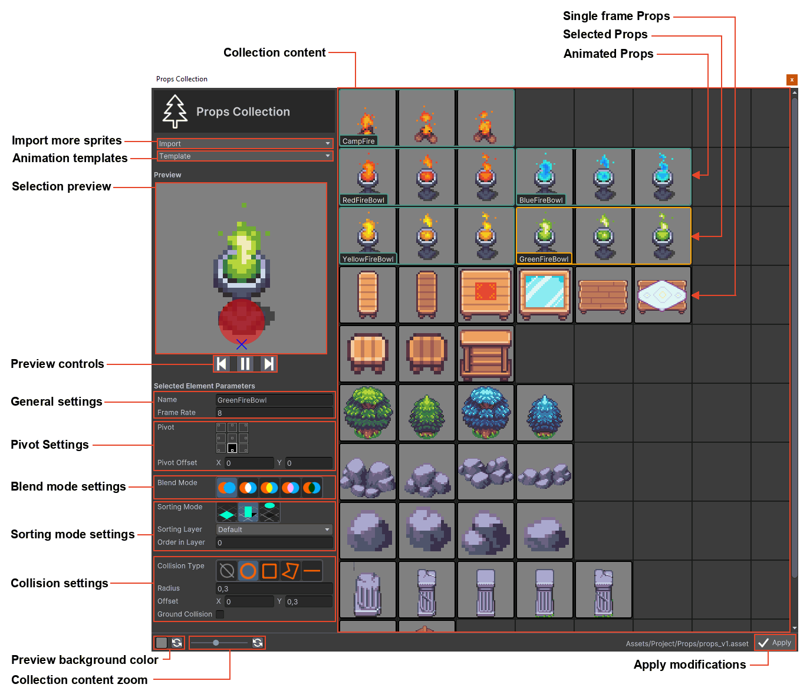

# Props Collection

This section covers the RPG Power Forge feature : Props Collection !

```admonish warning title="🛠️"
Working on it !
```

## Summary

## Feature definition
```admonish summary title="Props Collection"
The Props Collection feature allows you to arrange, edit and customize props (single frame or animated). You can created animated ones, attach colliders, define sorting mode, blend mode, and more !
```

## Feature location

### From the Assets Picker


Or



### From the Project window

## Feature details

### Window content
