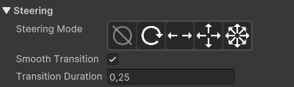

# Properties
This section covers the RPG Power Forge feature : Properties !

```admonish warning title="I'm on it..."
This section is in work-in-progress ! 
```

## Summary

## Feature definition
```admonish summary title="Properties"
The Properties feature allow you to manage the general aspect of your props, tiles, Actors, ...
```


## Feature location

### From the Tool Bar


## Feature details

### Steering
```admonish summary title="Steering"
Steering is about how Actors or Props move and interact within the game world. For example: in a TopDown game, this is where you define if your Actor has 4 or 8 directions.
```
 


Icon | Title | Definition
---|---|---
 | None | No steering.
 | None | No steering.
 | None | No steering.
 | None | No steering.
 | None | No steering.