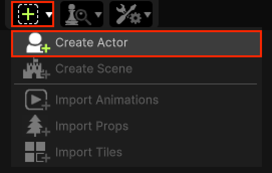
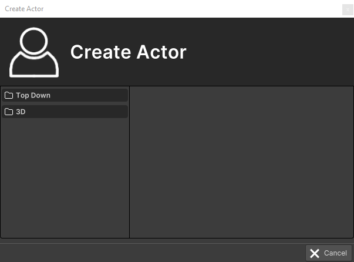
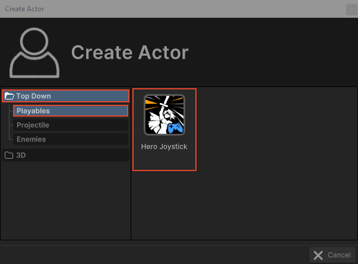
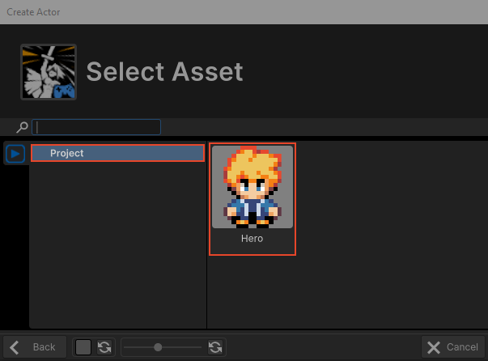
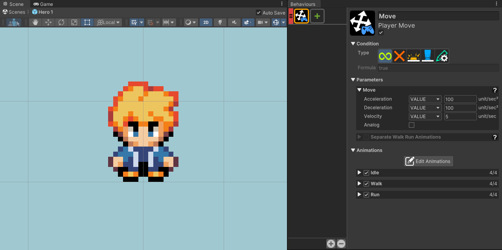
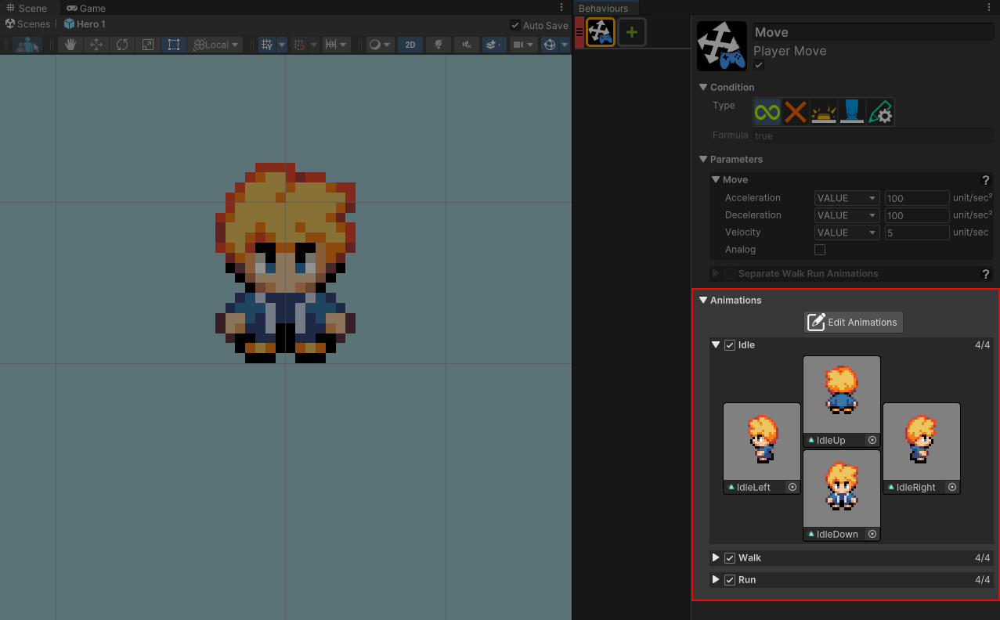
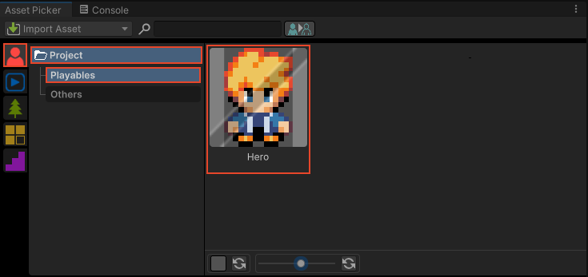
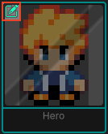

# Actor Creation

This section covers the RPG Power Forge feature : Actor Creation !

```admonish success title="Oh yeah"
This section is up-to-date !
```

## Summary

## Feature definition
```admonish summary title="Actor Creation"
The Actor Creation feature allows you to create high-level RPG Actors : Player, NPC, chest, various monsters, ... 
```

## Feature location

### From the Tool Bar



## Feature details

### Overview



The Action Creation feature window is splitted in 2 panels :
* left panel : small explorer to navigate between Actors types.
* right panel : all of the available Actors for the current selected type.

### Create a new Actor

Let's say we want to creat a new playable character. [[Select Top Down > Playables > Hero Joystick]] :



A second window (embedded Asset Picker) will ask you to choose an Animation Collection for your Actor. This step is used to automatically assign animations to your Actor.

Here we can use the Hero Animation Collection which contains Idle, Walk and Run animations. [[Select the Hero Animation Collection]] :



### Discover Actor Behaviors

Congratulations ! Your new Actor is now ready to be used. This particular one only have a Move behavior, but hey, it's something !



The previously selected Animation Collection has been automatically assign to the Idle, Walk and Run animation slots of the Move Behavior :




### Edit an existing Actor
You can find all of your Actors in the Asset Picker, in the Actor tab :



If necesary, you can always edit Behaviors of any Actor directly from the Asset Picker. Just [[hover it and select the Edit icon]] to open the Unity Prefab view :

