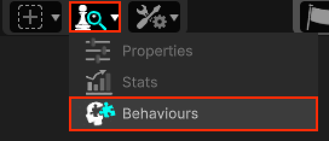
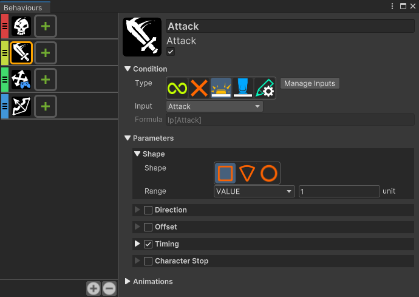

# Behaviors

This section covers the RPG Power Forge feature : Behaviors !

```admonish warning title="Working, working ..."
This section is in wok-in-progress
```

## Summary

## Feature definition
```admonish summary title="Behavior"
The Behavior feature gives you the possibility to attach various behaviors to Actors (prefabs). For example, adding the "Attack" behavior to a Player Actor allows them to perform attacks during play.
```

## Feature location

### From the Tool Bar



## Feature details

### Overview



The Behavior feature window is splitted in 2 panels :
* left panel : list of all attached Behaviors to the current Actor.
* right panel : detail of the current selected Behavior from the left panel.

### Behaviors list