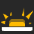

A Behavior is activated depending on its selected Condition :

Icon|Name|Definition
---|---|---
|Always| The Behavior is activated without Condition.
|Never| The Behavior is never activated.
|Input press| The Behavior is activated if the requested Input is pressed. See [Input Management](./input_management.md) for more.
|Input hold| The Behavior is activated if the requested Input is holded. See [Input Management](./input_management.md) for more.
|Custom| The Behavior is activated if the formula returns true. See [Formula Management](./formula_management.md) for more.