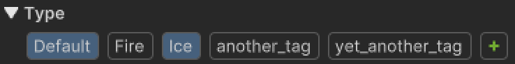

A type is a keyword you can attach to a Behavior to even more customize its reaction when it interact with another Behavior. 

[[Select a type to activate/desactivate it (green ➕ to manage types)]].

