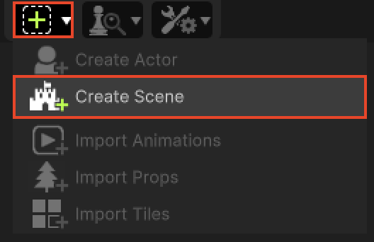
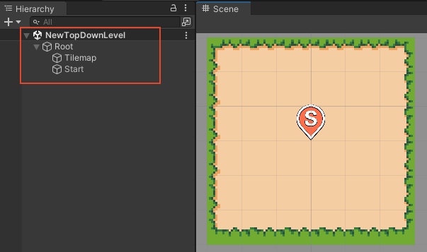

# Scene Creation

This section covers the RPG Power Forge feature : Scene Creation !

```admonish success title="Oh yeah"
This section is up-to-date !
```

## Summary

## Feature definition
```admonish summary title="Scene Creation"
The Scene Creation feature allows you to create a new Scene in Unity with predefined settings (player spawn point, tilemap, ...)
```

## Feature location

### From the Tool Bar



## Feature details

### New Unity Scene
When you select the "Create Scene" option, a new Unity Scene is created with the following GameObjects :
* **Root** : A parent GameObject for the whole Scene.
  * **Tilemap** : A Tilemap GameObject to draw tiles on it.
  * **Start** : A Spawner GameObject for the Player character. 

