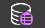
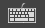

# Tool Bar

This section covers the RPG Power Forge feature : Tool Bar !

```admonish success title="Oh yeah"
This section is up-to-date !
```

## Summary

## Feature definition
```admonish summary title="Tool Bar"
The Tool Bar gives you access to most of the features to make a great RPG game, from importing assets to shipping your game online.
```

## Feature location

The Tool Bar is located on the top side of the Unity Editor window :


## Feature details

### Undo / Redo

Icon | Title | Functionnality
---|---|---
 | Undo | Reverse the last action.
 | Redo | Reapply the last reversed action.
 | History | Browse the actions history.
### Assets management

Icon | Title | Functionnality
---|---|---
 | Asset Picker | Open the Asset Picker window.
 | Asset creation / import | Main dropdown menu.
 | Create Actor | Open the Create Actor wizard window.
 | Create Scene | Open the Create Scene wizard window.
 | Import Animations | Open the Import Animations wizard window.
 | Import Props | Open the Import Props wizard window.
 | Import Tiles | Open the Import Tiles wizard window.
### Game management

Icon | Title | Functionnality
---|---|---
 | Data | Main dropdown menu.
 | Properties | Open the Properties window.
 | Statistics | Open the Statistics window.
 | Behaviors | Open the Behaviors window.

### Project settings

Icon | Title | Functionnality
---|---|---
 | Settings | Main dropdown menu.
 | Database | Open the Database window.
 | Level Linker | Open the Level Linker window.
 | Project | Open the Project window.
 | Localization | Open the Localization window.

### Debug mode

Icon | Title | Functionnality
---|---|---
 | Markers | Toggle (visible/invisible) + main dropdown menu.
 | Collisions | Choose color and opacity for the Collisions markers.
 | Triggers | Choose color and opacity for the Triggers markers.
 | Hit Boxes | Choose color and opacity for the Hit Boxes markers.
 | Interactions | Choose color and opacity for the Interactions markers.
 | Camera Walls | Choose color and opacity for the Camera Walls markers.

### Play and controls
Icon | Title | Functionnality
---|---|---
 | Play | Play button to run the current Scene.
 | Controller | Main dropdown menu.
 | Keyboard | Choose the keyboard to control the Player.

### Build the game
Icon | Title | Functionnality
---|---|---
 | Build | Main dropdown menu.
 | Build for PC | Open the Build for PC/Mac/Linux window.
 | Build for Web | Open the Build for Web window.

### Editor layouts
Icon | Title | Functionnality
---|---|---
 | Layouts | Main dropdown menu.
### Help and documentation
Icon | Title | Functionnality
---|---|---
 | Help | Main dropdown menu.
 | Online documentation | Open the online documentation in your internet browser.
 | About | Open the About window.