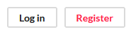
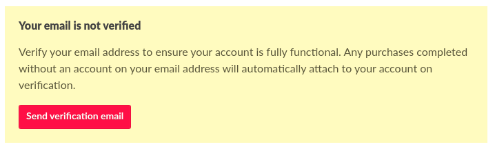
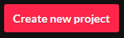
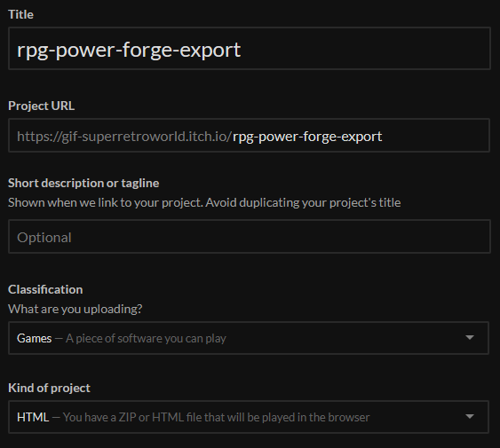
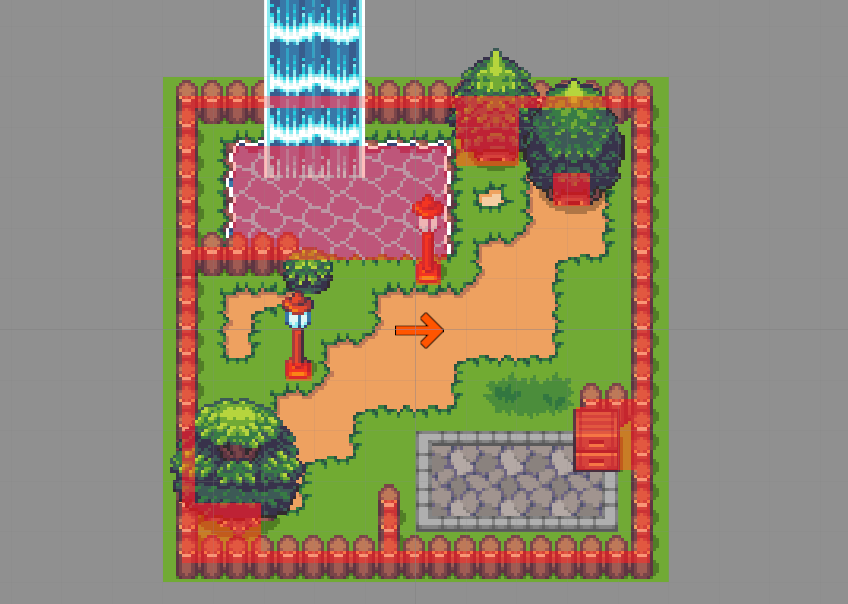
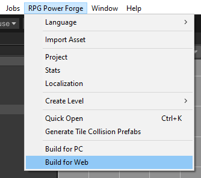

# Export your game to itch.io

This section covers the export of a game made with **RPG Power Forge** to itch.io (an online plateform and marketplace for game developpers)

To export your game to itch.io, you will need an itch.io project first.

---
## Create a project on itchio

Go to https://itch.io. In the top-right corner of the webpage, select [Register]

Fill the form and login to your new account.

### Verify your mail adress

Once logged in, go to your profile settings and ask for a verification.

> 🐲 You won't be able to export your game from **RPG Power Forge** to itchio if you don't verify your mail adress first.

### Create a new project

Go to your dashboard (https://itch.io/dashboard) and select [Create new project].

Fill the form accordingly :
* Title : whatever you like
* Project URL : autofill from Title field, but you can edit it if you like
* Short desctription : optional oneliner.
* Classification : **Game**
* Kind of project : **HTML**

> 🐲 The project URL is important because it will be used by **RPG Power Forge** to find it on itch.io.

Hit [Save]. Your project is ready !

## Export your game to itchio

Go back in **RPG Power Forge**. As you can see, I have an awesome map to export.

Choose [Build for Web] in the drop-down menu.

