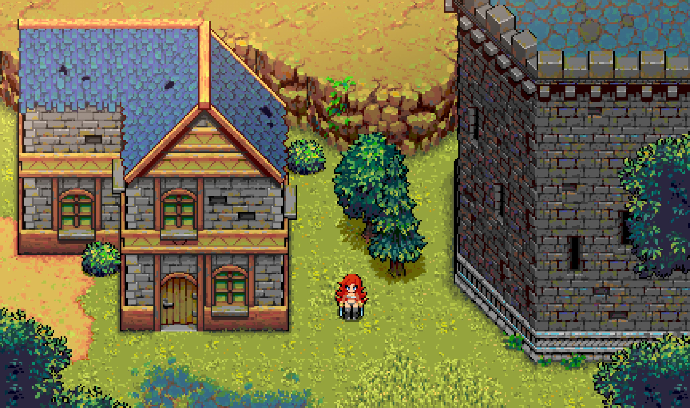

# Welcome !
**RPG Power Forge** is a 2D RPG game-engine assistant in **Unity**.

Want to import animated autotiles, have pixel-perfect collisions or create a chest in 1 click ? That's the spirit ✨

## Summary
- [Why are we making RPG Power Forge ?](#why-are-we-making-rpg-power-forge)
- [What can you expect to make with RPG Power Forge ?](#what-can-you-expect-to-make-with-rpg-power-forge)
- [Will RPG Power Forge be shipped with game assets as well ?](#will-rpg-power-forge-be-shipped-with-game-assets-as-well)

## Why are we making RPG Power Forge

Unity is quite powerful and we love it, but the entry ticket is, well, a bit expensive.

Our goal is to provide tools and features to make Unity an easier experience for gamedev.

## What can you expect to make with RPG Power Forge

We are primarily developping features for 2D topdown RPG with an Action-RPG battle system.

## Will RPG Power Forge be shipped with game assets as well

Yes ! See below :

- Super Retro World
[https://gif-superretroworld.itch.io](https://gif-superretroworld.itch.io)
- Desire Fantasy
[https://noiracide.itch.io/df-grasslands](https://noiracide.itch.io/df-grasslands)
- Nostalgia Legends
[https://noiracide.itch.io/plainstileset-nostalgialegends](https://noiracide.itch.io/plainstileset-nostalgialegends)
- RPG Power Forge Music pack : *we're packaging it, be patient !*

{{#include glossary.md}}