# Tiles heights

This section covers tiles and collisions heights ! 

> 🐞 [Bug tracker here](https://trello.com/b/PIzgsYov/rpg-power-forge-road-map)

## Summary
- [Window location](#window-location)
- [Window content](#window-content)
- [Apply the height of tiles manually](#apply-the-height-of-tiles-manually)
- [Apply the height of tiles automatically](#apply-the-height-of-tiles-automatically)
    - [The Fill tool](#the-fill-tool)
- [How to go above and below](#how-to-go-above-and-below)
    - [The Hammer tool](#the-hammer-tool)
    - [The Stair prefab](#the-stair-prefab)
    - [Demonstration](#demonstration)
- [Add custom collisions](#add-custom-collisions)

## Window location

You can open the **Tile Height Setter** from the **Window** top menu.

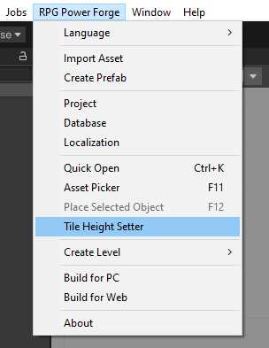

## Window content

The **Tile Height Setter** window has few sections :
* A "toggle visibility" button
* A set of tool to apply height to tiles easily
* A tilemap selector (same as the **Tile Palette**)
* A height selection, from 0 (lower) to 9 (higher)

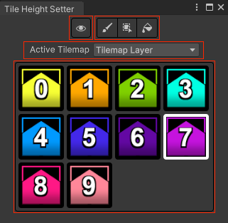

## Apply the height of tiles manually

It's quite simple actually !

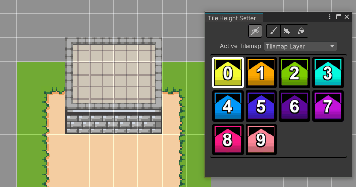

## Apply the height of tiles automatically

You can always select you tile and a specificheight when drawing !

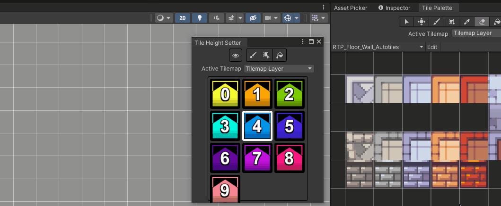

### The Fill tool

The **Fill** tool speedup your workflow when editingthe whole height of a specific tile/autotile :

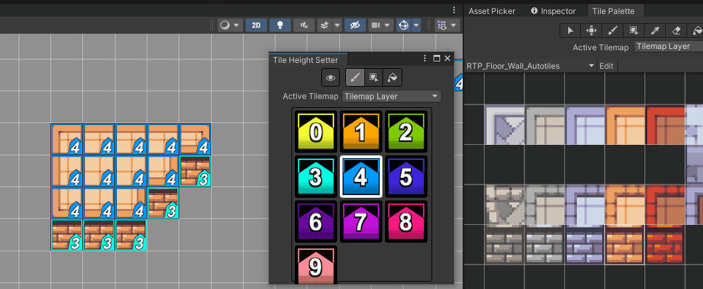

## How to go above and below

### The Hammer tool

Start by breaking breaking some autotiles collisions. To do so, use the *Hammer** tool in the **Tile Palette** window, and click on any tile collision :

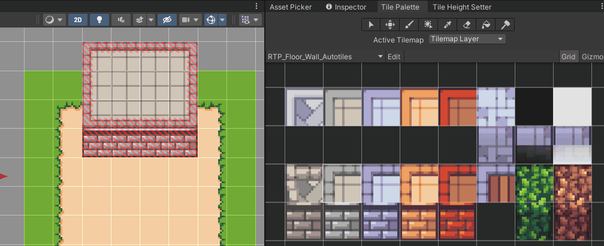

> 🐲 The **Hammer** is cool! \<CTRL+Z\> or *hammer-click* again too re-apply the tile collision.

### The **Stair** prefab

To change height of your playable character during play, you need to tell **RPG Power Forge** where the stairs are. This is where the **Stair prefab** comes in !

In the **[Asset Picker](./place_props.md)**, select the **Stair** prefab (under Built-In/LD). In our example, we are using the **TopDownStair** prefab.

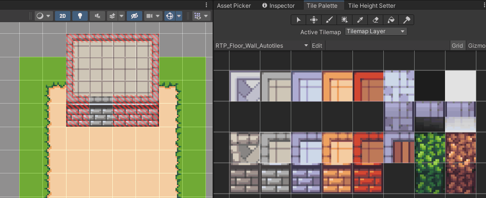

> 🐲 Hold \<CTRL\> key went dragging a prefab to align it with the grid !

### Demonstration

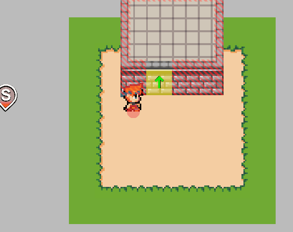

## Add custom collisions

Good ! But it could be better... We should add some collisions to prevent our character from running below everything. Let's utilize the **Custom colliders** prefabs !

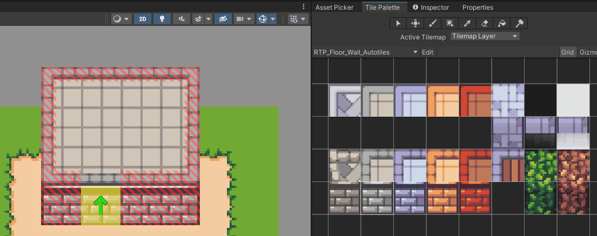

> 🐲 Make sure the custom collider is at the correct height ! Use the **[Properties](./properties.md)** window to check that. In our example, the collider should be at height 0 :

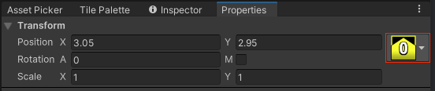

Much better now !

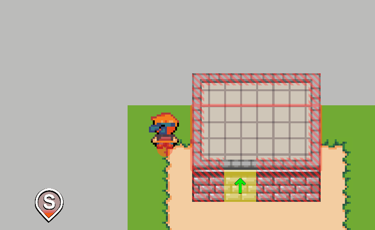
