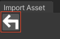
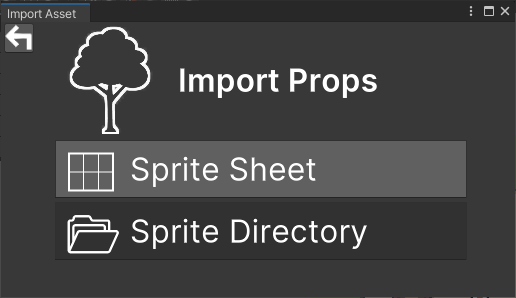
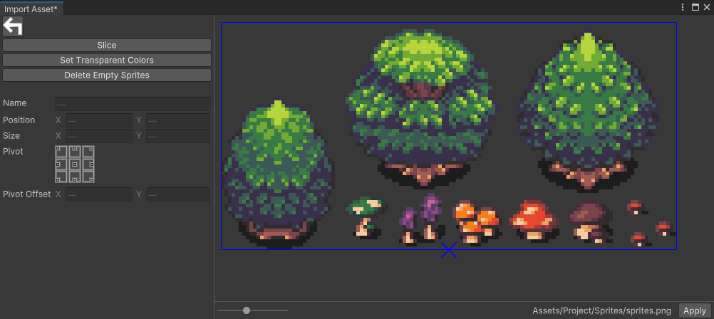
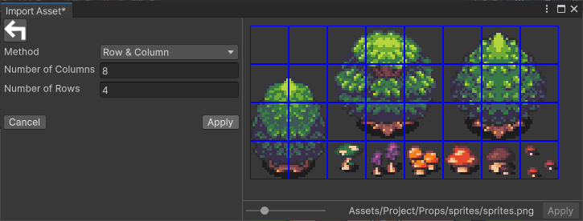
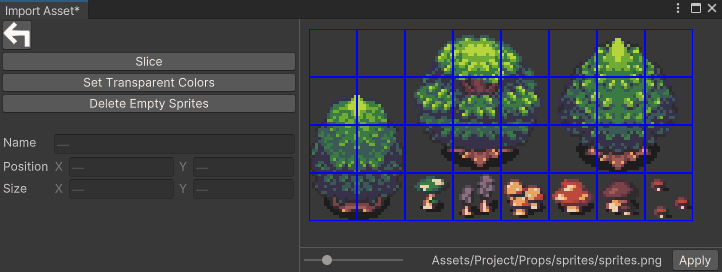
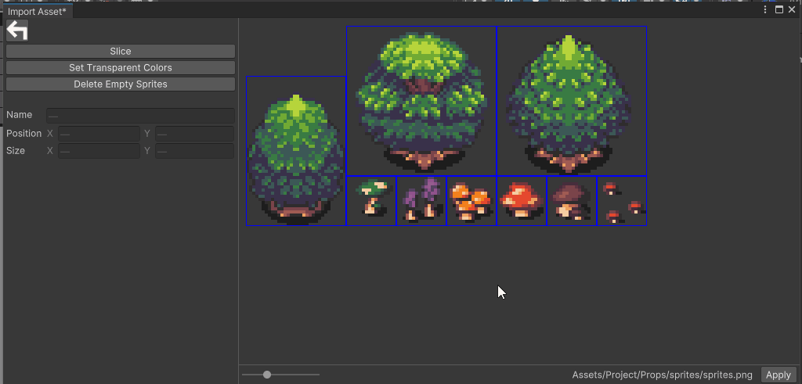
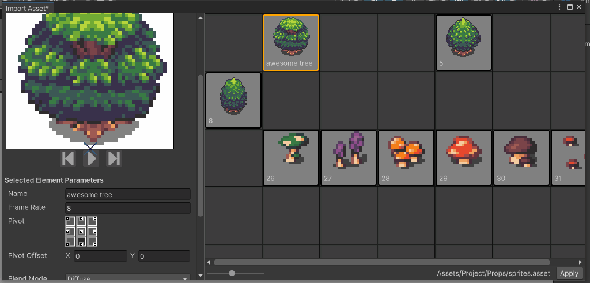
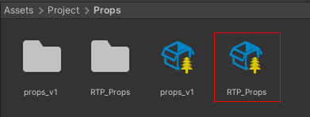
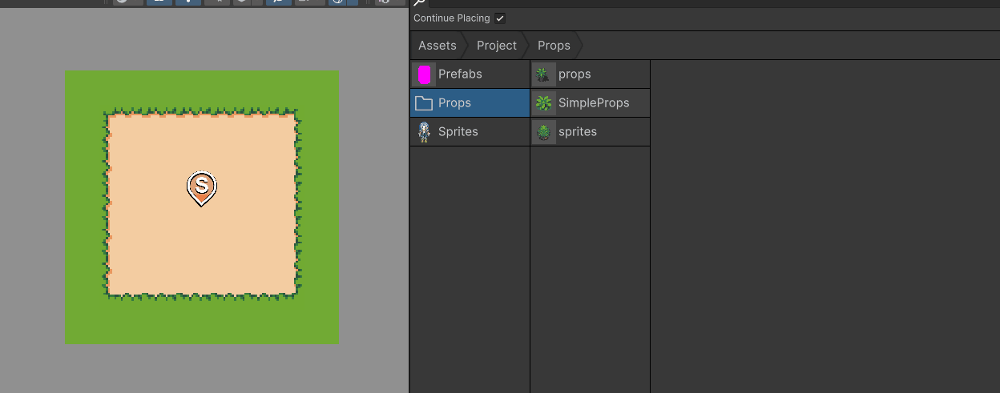

# Import Props

This section covers the import of a **Property** (*props* for short) into **RPG Power Forge**. A prop is an object you place in your map, like a tree 🌳 or a barrel 🛢️ !

> 🐞 [Bug tracker here](https://trello.com/b/PIzgsYov/rpg-power-forge-road-map)

## Summary
- [Recommendations](#recommendations)
- [Window location](#window-location)
- [Window content](#window-content)
- [Import the sprite sheet](#import-the-sprite-sheet)
    - [Slice the sprite sheet](#slice-the-sprite-sheet)
    - [Set Transparent Colors](#set-transparent-colors)
    - [Merge slices](#merge-slices)
    - [Delete empty slices](#delete-empty-slices)
- [Create the Props Collection](#create-the-props-collection)
    - [Arrange the Props Collection](#arrange-the-props-collection)
    - [Apply the Props Collection](#apply-the-props-collection)
- [Place Props on the map](#place-props-on-the-map)

## Recommendations
- At any time, you can hit the **[Back Button]** to cancel current edit and go back to the previous UI panel :

- You can import a set of free resources here : [resources.zip](./../media/zip/resources.zip)
- If you quit the UI during the import without (with the top-right❌button), nothing will be saved and you will need to restart the import.

## Window location

To import props (arranged in a sprite sheet), you need to access the **Import Assets** User Interface (UI). It is located under the **RPG Power Forge** menu.

## Window content

The UI let you choose what kind of assets you want to import.

## Import the sprite sheet

Let's import props from the free resources archive linked in the above [Recommendations](#recommendations) section.

To do so, select **Props > Sprite Sheet** and choose the above file (download it first !).

### Slice the sprite sheet

Select **[Slice]** to be able to slice your sprites according to the grid they are on. Here our sprites are placed on a 4x8 tiles grid, with each tile being 16x16 pixels. We can either slice by tile size or number of row/columns.

Property|Type|Function|Example
--------|--------|--------|--------
**Pixel Size**|Integer|X and Y sizes (in pixel) of a single sprite on the spritesheet|16 by 16
**Row & Column** |Integer|number of rows and columns of sprites on the spritesheet|8 by 4

Select **[Apply]** to apply the slice.

### Set Transparent Colors

*In developpement*

### Merge slices

If some of your sprites are bigger than a slice, you can merge slice together to reassemble the sprite.

> 🐲 \<SHIFT\> + left-click to select **multiple** slices. Right-click to **Merge** them !

### Delete empty slices

You can get rid of empty slices by cliking the **[Delete Empty Sprites]** button !

## Create the Props Collection

Once you are satisfied with the slice and merge, you can click **[Apply]** to create the **Props Collection** !

If you select a **[Props]** (like the tree in the above example) you will access its properties :

Property|Type|Function|Example
--------|--------|--------|--------
**Name**|String|Name of the Props|my tree
**Framerate** |Integer|How fast the Props is animated (if animated)|8
**Pivot** |Selector | Where the ?pivot? point is located| bottom-center
**Pivot Offset** | (X;Y) | How much the ?pivot? point is offset from the previous selector| 0;0
**Blend Mode** | Selector | How the Props is rendered on the map (great for light effects !)| Diffuse
**Sorting Mode** | Selector | How the Props is sorted on the map comparing to the player and other props| Standing
**Sorting Layer** | Selector | On which layer the Props is| Default
**Order in Layer** | Integer | For the selected layer above, on which position is rendered the Props| 0
**Collision Type** | Selector | What kind of collision the Props has| Box
**Ground Collision** | Chekcbox | Is the collision only for grounded object or also flying ones like bullets or birds| Unchecked

### Arrange the Props Collection

You can always rearrange the Props for a better readability !

### Apply the Props Collection
Once you are satisfied with the parameters and settings, you can select **[Apply]** to close the window.

> 🐲 This is a **Props Collection**. Double-click this object in your Project window to edit your props again if necessary !

## Place Props on the map

We have added a UI specifically to find and place props on the map. The UI is called the **[Asset Picker](./place_props.md)** ! 

> 🐲 The subfolder where your **Props** are located is named after the spritesheet filename you've imported.

{{#include glossary.md}}