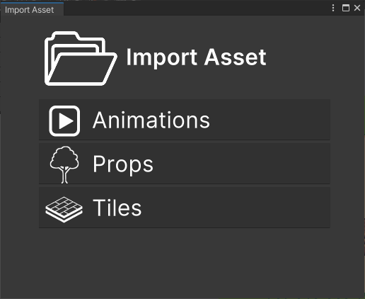

# Import sprites

This section covers the import of a sprites into **RPG Power Forge**.

> 🐞 [Bug tracker here](https://trello.com/b/PIzgsYov/rpg-power-forge-road-map)

---
## Import Assets UI

To import a spritesheet, you need to access the **Import Assets** User Interface (UI). It is located under the **RPG Power Forge** menu.

The UI let you choose what kind of assets you want to import.

---
## Import Srites

Let's import the following picture and make sprites out of it !

> 🐲 So small lol

To do so, select **Sprites > Sprite Sheet** and choose the above file (download it first !).

The following properties do not need to be edited and will be automatically updated after the slice.

Property|Type|Function|Example
--------|--------|--------|--------
Name|String|Name of the selected sprite| sprite_001
Position|Integer|X and Y positions (in pixel) of the selected sprite on the spritesheet|[0;0]
Size|Integer|X and Y sizes (in pixel) of the selected sprite on the spritesheet|[16;20]
Pivot|Selector|Pivot position on the selected sprite (fast selection)|bottom-center
Pivot Offset|Integer|Pivot offset on the selected sprite (pixel selection)|[0;0]

---
## Slice

Select **[Slice]** to be able to slice your sprites according to the following properties.

Property|Type|Function|Example
--------|--------|--------|--------
Method|Enum|Slice method (Pixel Size or Column & Rows numbers)| Pixel Size
Pixel Size|Integer|X and Y sizes (in pixel) of a single sprite on the spritesheet|[16;20]
Row & Column |Integer|number of rows and columns of sprites on the spritesheet|[12;8]
Pivot|Selector|Pivot position on the sprite(s) (fast selection)|bottom-center
Pivot Offset|Integer|Pivot offset on the sprite(s) (pixel selection)|[0;0]

> 🐲 In our example, we use **Pixel Size : 16 by 16**

---
## Set Transparent Colors

*In developpement*

---
## Merge sprites !

> 🐲 \<SHIFT\> click to select **multiple** sprites. Right-click to **Merge** them !

## Sprites location

Press **Apply** and your sprites are now located in the **Asset picker** !

