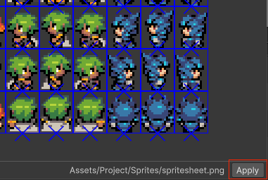
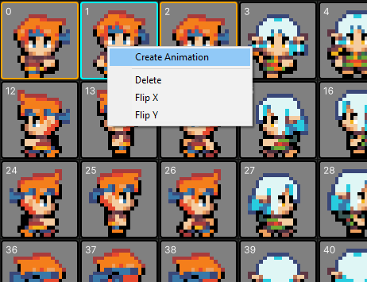

# Import a spritesheet

This section covers the import of a spritesheet into **RPG Power Forge** as well as the creation of animations.

---
## Import Assets UI

To import tiles, you need to access the **Import Assets** User Interface (UI). It is located under the **RPG Power Forge** menu.

The UI let you choose what kind of assets you want to import.

---
## Import Animations

You can import a spritesheet to convert it into a **Unity** animation file directly. For instance, let's say I want to import this spritesheet (a set of 8 characters walking in 4 directions, RPG Maker MZ convention):

To do so, select [Animations]

Then [Sprite Sheet]

The explorer opens, asking you to select the file itself. Here we will select the spritesheet.png shown above. Once selected, the spritesheet is loaded in the UI.

The following properties do not need to be edited and will be automatically updated after the slice.

Property|Type|Function|Example
--------|--------|--------|--------
Name|String|Name of the selected sprite| sprite_001
Position|Integer|X and Y positions (in pixel) of the sprite(s) on the spritesheet|[0;0]
Size|Integer|X and Y sizes (in pixel) of the sprite(s) on the spritesheet|[16;20]
Pivot|Selector|Pivot position on the sprite(s) (fast selection)|bottom-center
Pivot Offset|Integer|Pivot offset on the sprite(s) (pixel selection)|[0;0]

---
## Slice

Select [Slice] to be able to slice your spritesheet according to the following properties.

Property|Type|Function|Example
--------|--------|--------|--------
Method|Enum|Slice method (Pixel Size or Column & Rows numbers)| Pixel Size
Pixel Size|Integer|X and Y sizes (in pixel) of the sprite(s) on the spritesheet|[16;20]
Pivot|Selector|Pivot position on the sprite(s) (fast selection)|bottom-center
Pivot Offset|Integer|Pivot offset on the sprite(s) (pixel selection)|[0;0]

---
## Set Transparent Colors

*In developpement*

---
## Remove Empty Sprites

This action detects empty sprites (with only transparent pixels) and removes them before the sprites are loaded in **RPG Power Forge**.

---
## Other actions

At any time you can always select an individual sprite, or hold SHIFT key for multiple selection. Then right-click to access the sub-menu : Merge or Delete.

### Merge

Merge 2 (or more) sprites together to make 1 sprite.

### Delete

Delete the selected sprite(s). The deleted sprites are not loaded in **RPG Power Forge**.

---
## Apply the slice

Once you are OK, press [Apply] to validate your setup. Your spritesheet will be located in *Assets/Project/SPrites/spritesheet.png*

---
## Create animations

The next UI allows you to create animations from all of the sprites you have previously sliced.

Property|Type|Function|Example
--------|--------|--------|--------
Animation Name|String|Name of the animation you are creating|animation_01
Frame Rate|Integer|How fast the animation will run|8

### Create an animation

Select at least 2 neightboor sprites thanks to the SHIFT key and right-click.

Once created, the animation can be selected, renamed, edited and run with the [Play] button.

### Perform actions on individual sprites

