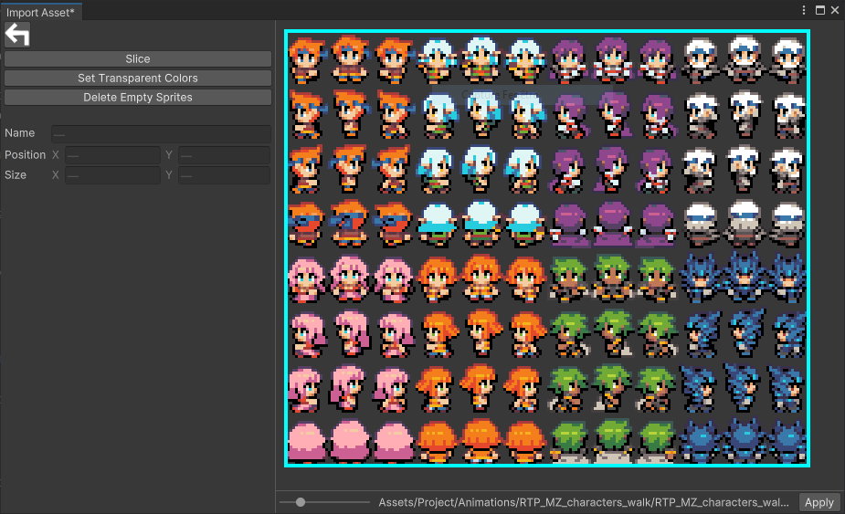

# **Import Animation**

This section covers the import and edition of an **Animation** into **RPG Power Forge**.

> 🐞 [Bug tracker here](https://trello.com/b/PIzgsYov/rpg-power-forge-road-map)

---
## **Import Assets UI**

To import an **Animation**, you need to access the **Import Assets** User Interface (UI). It is located under the **RPG Power Forge** top menu of Unity.

The UI let you choose what kind of assets you want to import.

---
## **Import Animations**

Importing an **Animation** means importing a serie of sprites (arranged in a spritesheet, Aseprite file, or folders), which then are animated by **RPG Power Forge**. For instance, let's say I want to import this spritesheet (a set of 8 characters walking in 4 directions, RPG Maker MZ convention):

> 🐲 "Right click > Save this image" in your computer for the next step

First, select **[Animations]**

Then **[Sprite Sheet]**

The explorer opens : select the spritesheet you've saved above. Once selected, the file is loaded in the UI :

The next step is to separate this spritesheet into individuals sprites. For this we use the **Slice** feature.

---
## **Slice a spritesheet**

Select **[Slice]** to be able to slice your sprites according to the grid they are on. Here our sprites are placed on a 12x8 tiles grid, with each tile being 16x20 pixels. We can either slice by tile size or number of row/columns.

Property|Type|Function|Example
--------|--------|--------|--------
**Pixel Size**|Integer|X and Y sizes (in pixel) of a single sprite on the spritesheet|16 by 20
**Row & Column** |Integer|number of rows and columns of sprites on the spritesheet|12 by 8

Select **[Apply]** to apply the slice.

---
## **Set Transparent Colors**

*In developpement*

---
## **Remove Empty Sprites**

This action detects empty sprites (with only transparent pixels) and removes them before the sprites are loaded in **RPG Power Forge**.

---
## **Merge & Delete**

At any time you can always select an individual sprite, or hold SHIFT key for multiple selection. Then right-click to access the sub-menu : Merge or Delete.

 - **Merge** : merge 2 (or more) sprites together to make 1 sprite.
 - **Delete** : delete the selected sprite(s). The deleted sprites are not loaded in **RPG Power Forge**.

> 🐲 \<SHIFT\> + left click to select **multiple** slices.

---
## **Create the Animations** 

Once you are OK, press **[Apply]** to validate your setup :

---
## Create animations

The next UI allows you to create animations from all of the sprites you have previously sliced.

You can move sprites freely (like cards) to rearrange them as you like. With right-click on a sprite you can also :
* FlipX
* FlipY
* Delete

### Create an animation with a template
If you are importing a spritesheet that respects RPG Maker convention you can use one of our templates to generate all of the animations at once !

*Tadaaa !* The template have been applied. All of the animations have been created correctly.

Below the available templates :

RM|Convention|Details
--------|--------|--------
2000-2003|Character| 4 x 2 characters spritesheet
2000-2003|Vertical| 4 x 2 item spritesheet (4 vertical frames)
2000-2003|Horizontal| 4 x 2 item spritesheet (3 horizontal frames)
XP|Character| 1 character spritesheet
XP|Vertical| 1 item spritesheet (4 vertical frames)
XP|Horizontal| 1 item spritesheet (3 horizontal frames)
VX/MV/MZ|Character| 4 x 2 characters spritesheet
VX/MV/MZ|Vertical| 4 x 2 item spritesheet (4 vertical frames)
VX/MV/MZ|Horizontal| 4 x 2 item spritesheet (3 horizontal frames)

> 🐲 Templates are super useful ! They allow you to import RPG Maker content in 1 click !

---
### Create your own template

*In developpement*

---
### Create an animation manually

Select at least 2 neighboring sprites thanks to < SHIFT key > + left-click. Then right-click to reach the menu.

Once created, the animation can be selected, renamed, edited and preview-run with the **[Play]** button.

## **Animation parameters**

Property|Type|Function|Example
--------|--------|--------|--------
Pivot|Selector|Where to place the pivot of the animation|South
Pivot Offset|X;Y|How much you want the pivot to be offset from the above selected position
Name|String|Name of the animation you are creating|Walk_Down
Frame Rate|Integer|How fast the animation will run|8
Points|List|Where to attach an object/weapon to the animation *(in developpement)*|
---
## **Apply the animations**

Once you are OK, press **[Apply]** to generate all of the animation you have created.

If you used a template, you will be prompted to name your characters / animated object :

Your animations will be located in *Assets/Project/Animations* folder, grouped under an **Animation Collection** file.

> 🐲 This is an **Animation Collection**. Double-click this object in your Project window to edit your animations if necessary !
