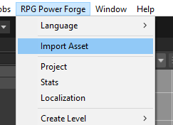
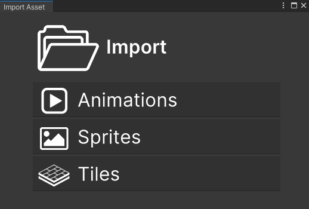
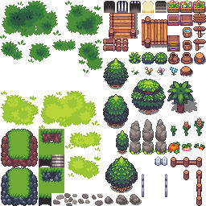
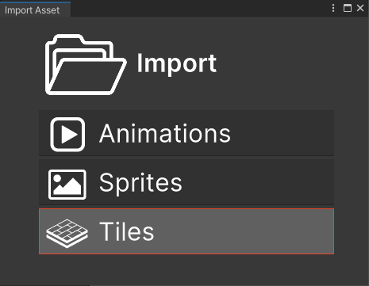
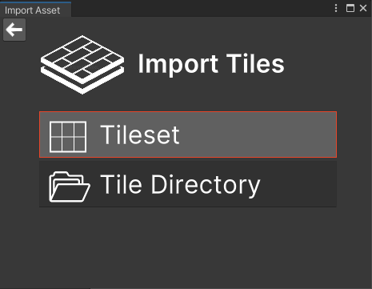
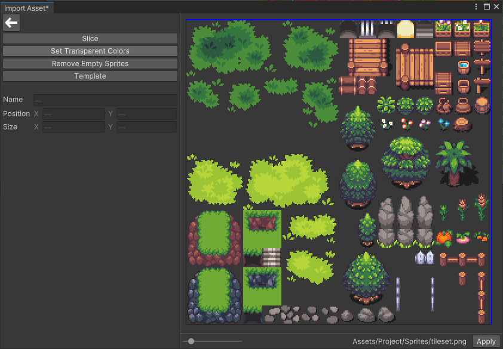
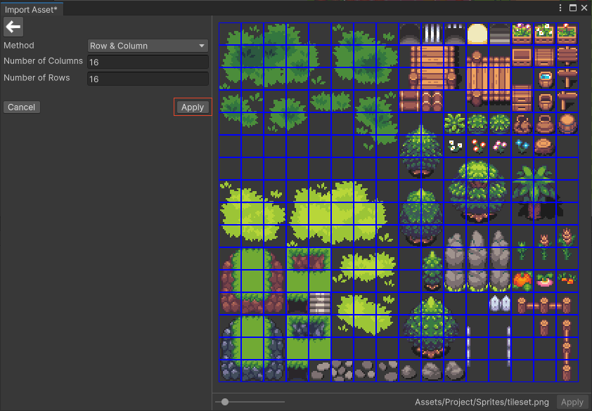
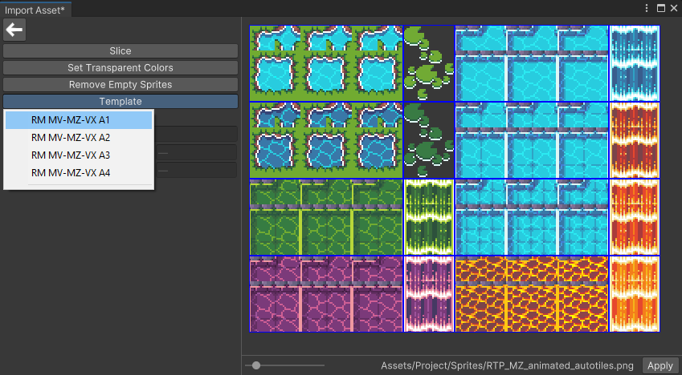
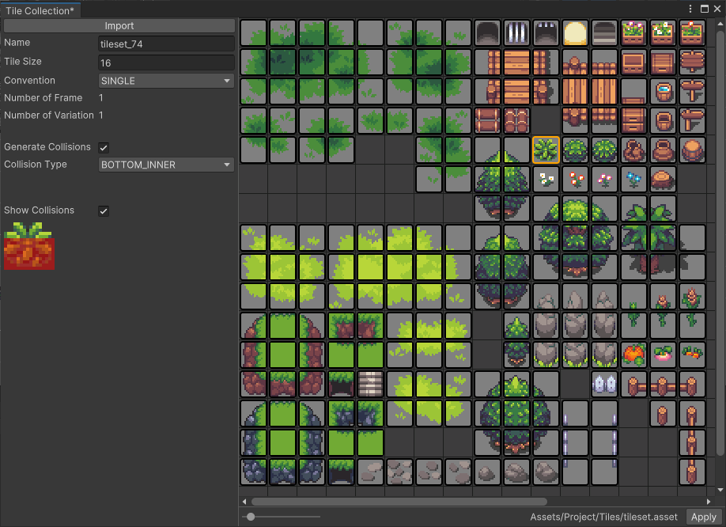
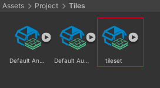

# Import a tileset

This section covers the import of a tileset into **RPG Power Forge**.

---
## Import Assets UI

To import tiles, you need to access the **Import Assets** User Interface (UI). It is located under the **RPG Power Forge** menu.

The UI let you choose what kind of assets you want to import.

---
## Import Tiles

You can import a set of tiles in **RPG Power Forge**. Let's try with the following sample.

To import this tileset, select [Tiles]

Then [Tileset]

The explorer opens, asking you to select the file itself. Here we will select the tileset.png shown above. Once selected, the tileset is loaded in the UI.

The following properties do not need to be edited and will be automatically updated after the slice.

Property|Type|Function|Example
--------|--------|--------|--------
Name|String|Name of the selected tile| sprite_001
Position|Integer|X and Y positions (in pixel) of the selected tile on the tileset|[0;0]
Size|Integer|X and Y sizes (in pixel) of the selected tile on the tileset|[16;20]

---
## Slice

Select [Slice] to be able to slice your tileset into tiles according to the following properties.

Property|Type|Function|Example
--------|--------|--------|--------
Method|Enum|Slice method (Pixel Size or Column & Rows numbers)| Pixel Size
Pixel Size|Integer|X and Y sizes (in pixel) of a tile on the tileset|[16;20]
Row & Column |Integer|number of rows and columns of tiles on the tileset|[16;16]

---
## Set Transparent Colors

*In developpement*

---
## Remove Empty Sprites

This action detects empty tiles (with only transparent pixels) and removes them before the tiles are loaded in **RPG Power Forge**.

---
## Template

Apply a template to your tileset (if it's an RM autotile). For example :

Property|Function
--------|--------|
RM MV-MZ-VX A1|Template for animated autotiles
RM MV-MZ-VX A2|Template for floor autotiles
RM MV-MZ-VX A3|Template for roof and wall autotiles
RM MV-MZ-VX A4|Template for floor and wall autotiles

---
## Apply the slice

Once you are OK, press [Apply] to validate your setup. Your tileset will be located in *Assets/Project/Sprites* folder.

---
## Edit tiles

The next UI allows you to edit each tile and define if they need a collision.

Once you are OK, press [Apply]. Your tiles will be located in *Assets/Project/Tiles* folder.

