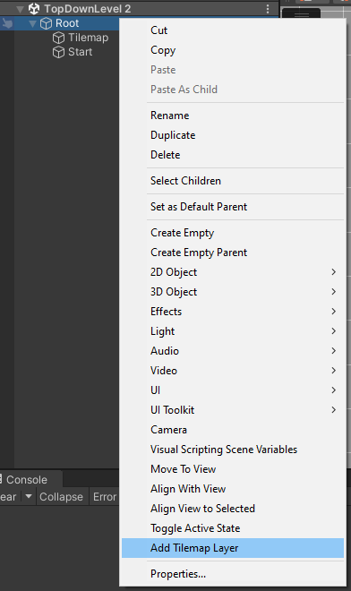
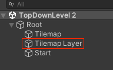

# Tile layers

This section covers the addition of tile layer ! (as known as *Tilemap* in **Unity**) :

> 🐞 [Bug tracker here](https://trello.com/b/PIzgsYov/rpg-power-forge-road-map)

---
## Create a new layer of tiles

To create a new layer, simply right-click the **Root** object in the **Hierarchy** window, and select "**Add a Tilemap Layer**" :

You now have a new layer for tiles !

> 🐲 Multiple layers are useful as soon as you want to draw at different height levels, or if you want to organize your tiles !