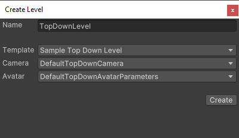

# Map

This section covers the creation of a new map (as known as *Scene* in **Unity**) :

> 🐞 [Bug tracker here](https://trello.com/b/PIzgsYov/rpg-power-forge-road-map)

---
## Create a new map

To create a new map, simply open the **RPG Power Forge** menu :

Map creation has a few properties :

Property|Type|Function|Example
--------|--------|--------|--------
File Name|String|Name of the map. Will serve as a filename for the .scene file| "new_map" or "my map 001"
Camera|Enum|    Type of camera to use to render the map    |DefaultTopDownCamera
Avatar|Enum|    Type of the playable character to instanciate on the map    |DefaultTopDownAvatarParameters

Select [Create] to create a new map.

 Once the map is created, you will see a bunch of default object added :
* [Root] object: every layers are attached to it
    * [Bottom Layer] object : a layer to draw tiles
    * [Middle Layer] object : a layer to draw tiles
    * [Upper Layer] object : a layer to draw tiles
    * [Start] object : where the player is instanciate in Play Mode.