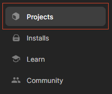
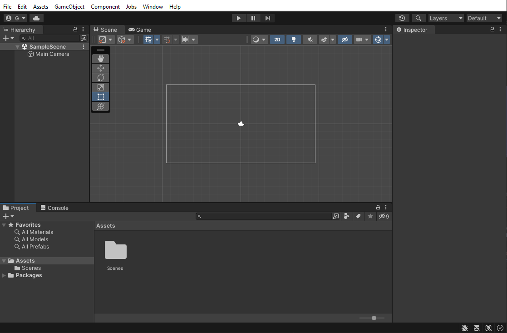
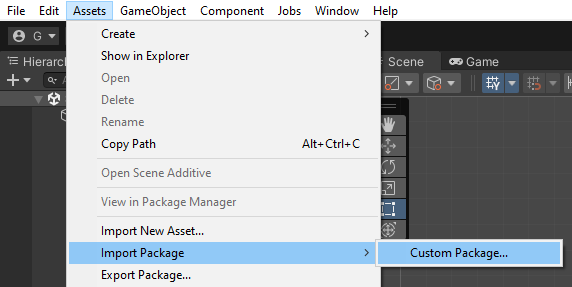
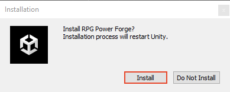
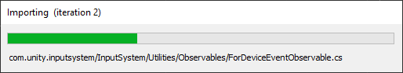

# Create a new project

This section covers the creation of a new Unity project with RPG Power Forge:
1. You will create a new **Unity** project from the **Unity Hub**
1. You will import **RPG Power Forge** in your new **Unity** porject.

---
## Create a new Unity project

To create a new project, open the **Unity Hub first**. Select the [Project] tab, from the left panel (should be selected by default).

Select the [New project] button on the top-right corner.

On the setting page, mind the steps :
1. Check the **Unity** version you are using (we recommend the last **Unity 2021.3**)
1. Select the [2D Core] template
1. Fill the project name and location
1. Click [Create project]

The project is loading for the first time.

Once initialized, the project will open. Congratulation !

---
## Import RPG Power Forge
*(this section is based on **Unity** documentation : https://docs.unity3d.com/Manual/AssetPackagesImport.html)*

**RPG Power Forge** is a **Unity** package (file with the ".unitypackage" extension). To import a **Unity** package, choose Assets > Import Package > Custom Package. A file browser appears, prompting you to locate the .unitypackage file.

In the file browser, select the file you want to import and click Open. Then, **Unity** will inform you the package you want to install will overwrite the current project setting : it's normal and expected.

* Since your project is empty, just select [Import].

The Import **Unity** package window displays all the items in the package already selected, ready to install. Make sure everything is selected and click [Import].

**RPG Power Forge** package is importing...

**RPG Power Forge** will ask you if you are OK to install it. Select [Install].

**RPG Power Forge** package is installing...

Once restarted, **Unity** now has **RPG Power Forge** installed. 

Congratulations !

---
## Unity UI overview
If you are not familiar with Unity, here is a quick overview.

The [Scene] window is where you place your objects to create a map.

The [Project] window is where you can browse all of your objects.

The [Hierarchy] window is where you can organize all of your objects in the current scene.

The [Inspector] window is where you can edit the properties of the current selected object.

