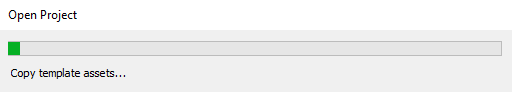
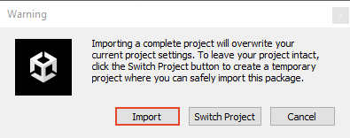
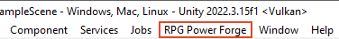

# Create a new project

This section covers the creation of a **RPG Power Forge** project !

> 🐞 [Bug tracker here](https://trello.com/b/PIzgsYov/rpg-power-forge-road-map)

## Summary
- [Create a new Unity project](#create-a-new-unity-project)
- [Import RPG Power Forge](#import-rpg-power-forge)

## Create a new Unity project

To create a new project, open the **Unity Hub first**. Select the **[Project]** tab, from the left panel (should be selected by default).

Select the [New project] button on the top-right corner.

On the setting page, mind the steps :
1. Check the **Unity** version you are using (we recommend the last **Unity 2021.3**)
1. Select the [2D Core] template
1. Fill the project name and location
1. Click [Create project]

The project is loading for the first time.

Once initialized, the project will open. Congratulation !

## Import RPG Power Forge
*(this section is based on **[Unity]** documentation : https://docs.unity3d.com/Manual/AssetPackagesImport.html)*

**RPG Power Forge** is a **[Unity]** package (file with the ".unitypackage" extension). To import a **[Unity]** package, choose Assets > Import Package > Custom Package. A file browser appears, prompting you to locate the .unitypackage file.

In the file browser, select the file you want to import and click Open. Then, **[Unity]** will inform you the package you want to install will overwrite the current project setting : it's normal and expected.

* Since your project is empty, just select [Import].

The Import **[Unity]** package window displays all the items in the package already selected, ready to install. Make sure everything is selected and click [Import].

**[RPG Power Forge]** package is importing...

**[RPG Power Forge]** will ask you if you are OK to install it. Select [Install].

**[RPG Power Forge]** package is installing...

Once restarted, **[Unity]** now has **[RPG Power Forge]** installed. You will find a new drop-down menu in th top bar, named "**[RPG Power Forge]**".

Congratulations ! With **[RPG Power Forge]** installed, you can now head to creation !