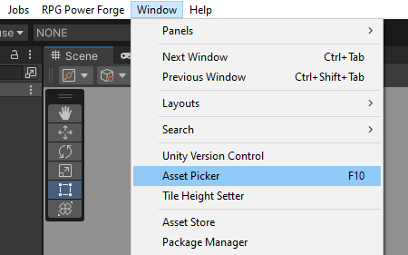
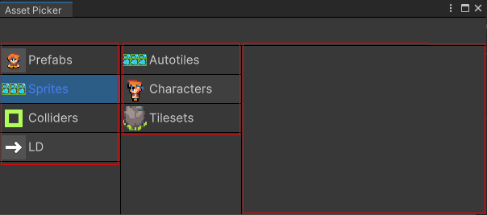
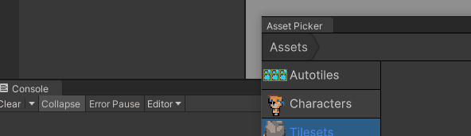
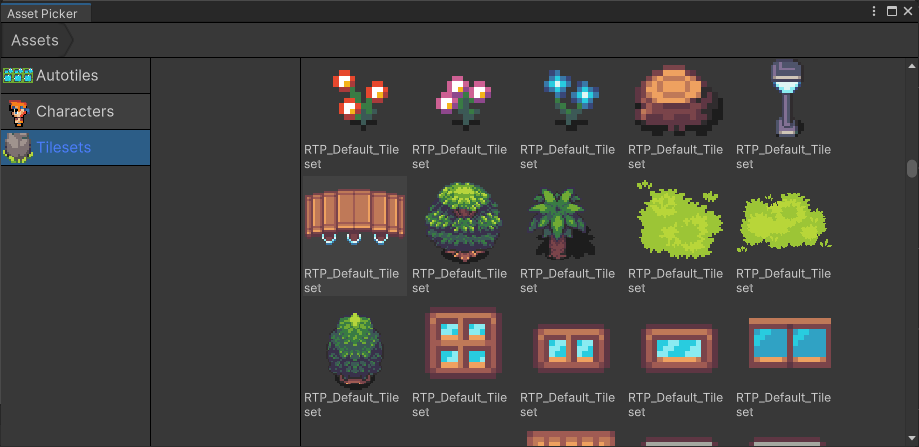
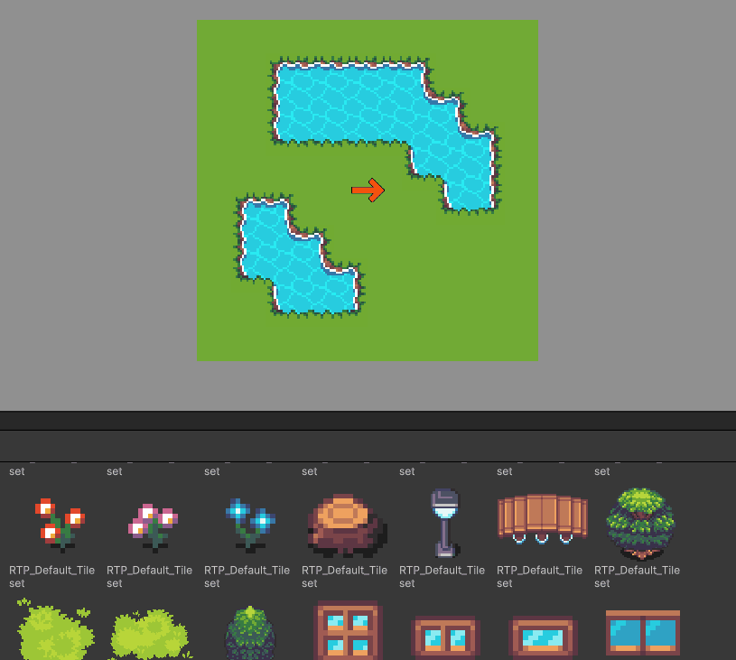
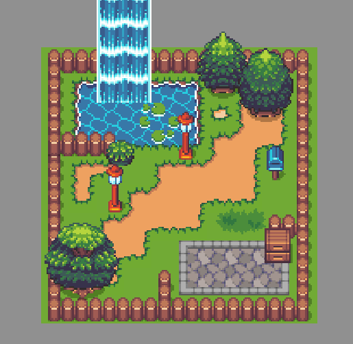

# Place props

This section covers props drawing ! To draw props, you will need 2 things :
* The **Asset Picker** window to select your props.
* A **map** where to draw props.

> 🐞 [Bug tracker here](https://trello.com/b/PIzgsYov/rpg-power-forge-road-map)

---
## Open the Asset Picker

You can open the **Asset Picker** from the **Window** top menu.

---
## Asset Picker Window

The **Asset Picker** window has few sections :
* Root category on the left
* Sub-categories next to it
* A preview of the props from the sub-category selected

> 🐲 You can snap the **Asset Picker** window in the layout with a simple click-and-drag !

---
## How to draw

Start by select a sub-category (in this example we choose [Tilesets]).

Now select a prop you want to place on the map. The prop is now snap to the mouse and you can click anywhere to place it.

Have fun creating maps !

---
## Default props

**RPG Power Forge** is shipped with default props (mostly natural elements such as trees and bushes)
