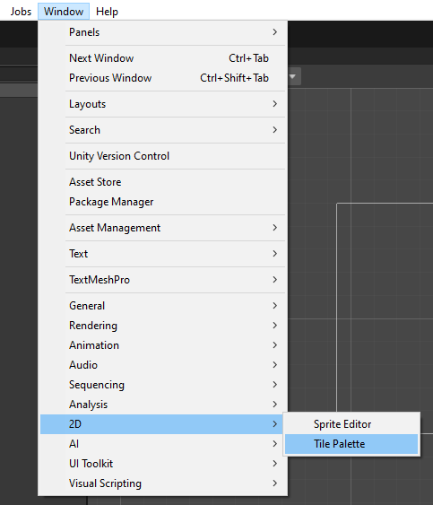
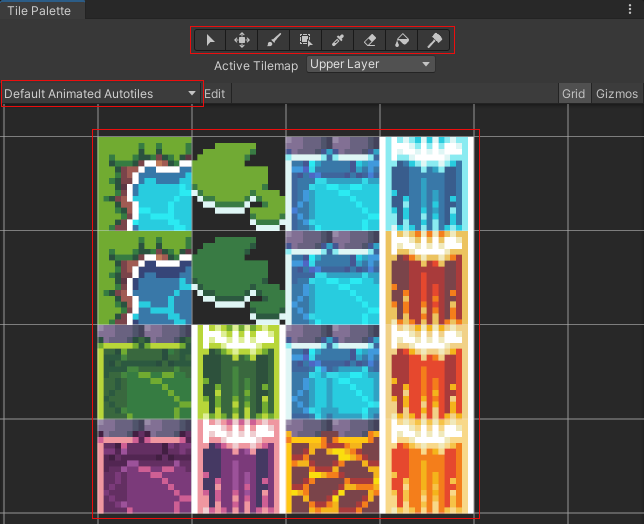
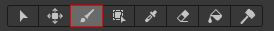
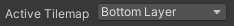
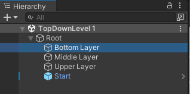
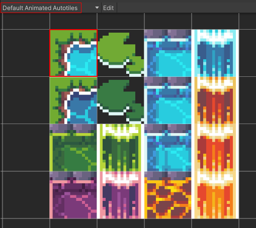
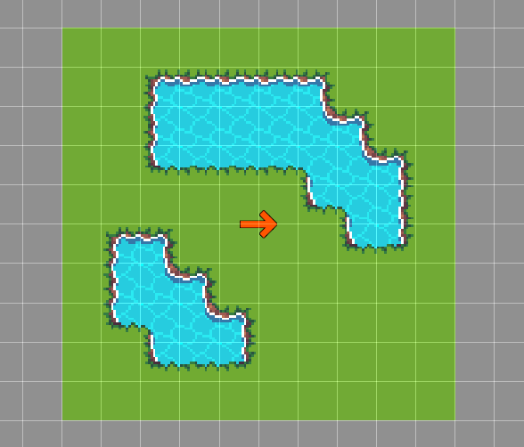

# Place tiles

This section covers tiles drawing ! To draw tiles, you will need 2 things :
* The **Tile Palette** window to select your tiles.
* A map **layer** where to draw tiles.

> 🐞 [Bug tracker here](https://trello.com/b/PIzgsYov/rpg-power-forge-road-map)

---
## Open the Tile Palette

You can open the **Tile Palette** from the **Window** top menu.

---
## Tile Palette Window

The **Tile Palette** window has few sections :
* A set of tools to draw and erase tiles
* A drop-down list to select the tileset your want
* A preview of the current tileset, where you can select tiles

---
## How to draw

Start by select the the pen tool.

Now select a layer to draw on. Either from the **Tile Palette** window.

Or from the **Hierarchy** window.

Select a tiles on the **Tile Palette** itself. for example, we are going to select the top-left water tile, from the  *Default Animated Autotiles* **Tile Palette**.

The selected tile is now bind to your mouse. You can left-click, hold and draw the tile on the layer !

> 🐲 Don't forget to select the correct layer to draw your tiles accordingly. Each map created is shipped with 3 default layers.

---
## Default Tile Palettes

**RPG Power Forge** is shipped with default **Tile Palettes**.

Tile Palette|Function
--------|--------
Default Animated Autotiles|A set of animated floor autotiles (16x16 pixel resolution)
Default Animated Autotiles-Extra|All of the possible combinaisons available for each animated autotile (16x16 pixel resolution). Useful if you want to draw one specific tile only.
Default Autotiles|A set of floor autotiles (16x16 pixel resolution)
Default Autotiles-Extra|All of the possible combinaisons available for each autotile (16x16 pixel resolution). Useful if you want to draw one specific tile only.
