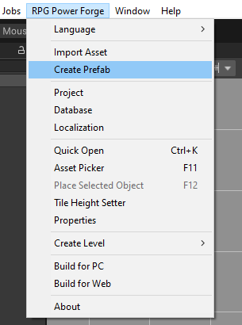
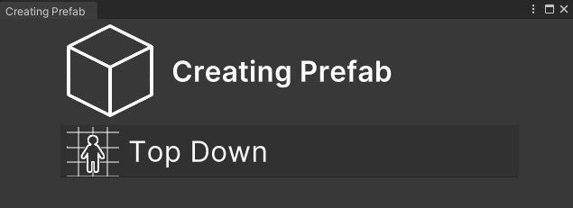
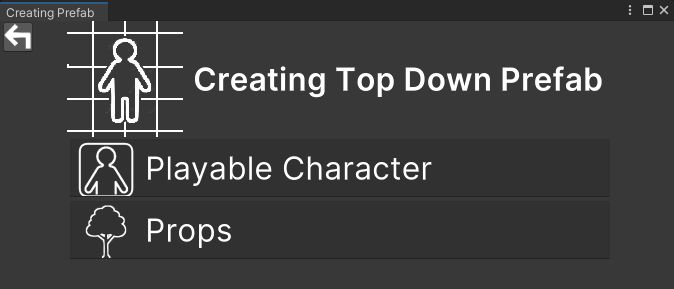
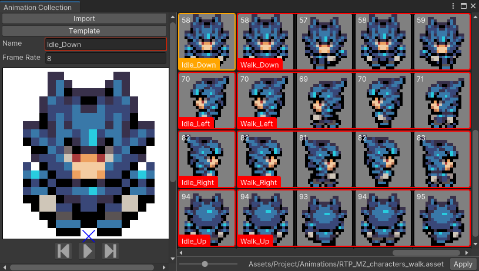
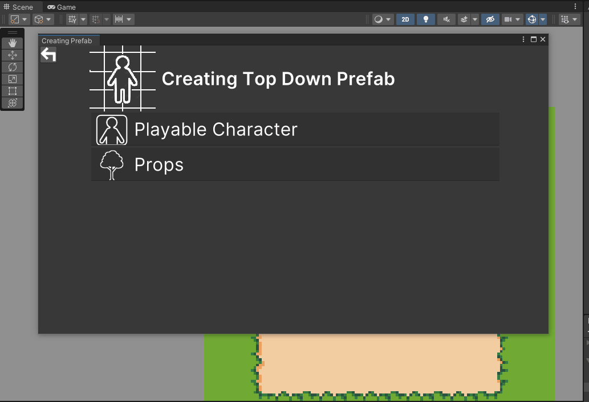
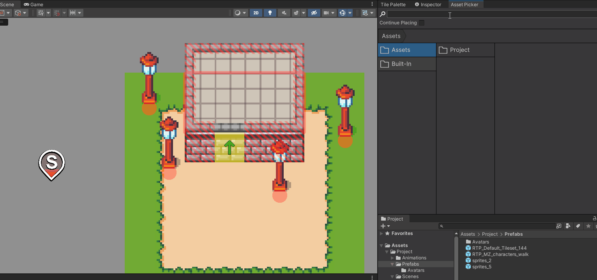
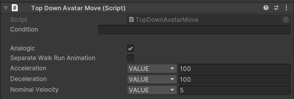
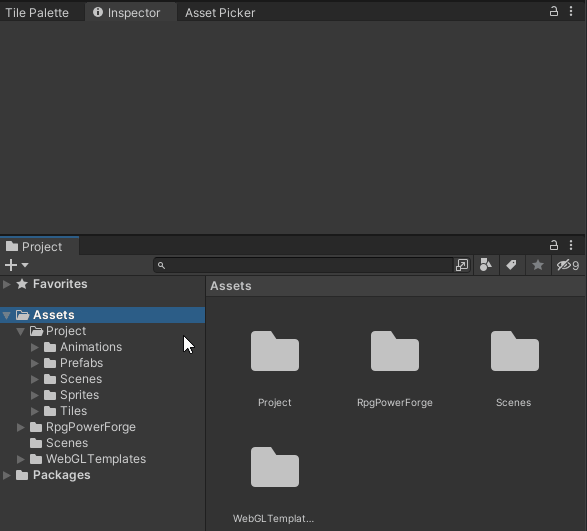
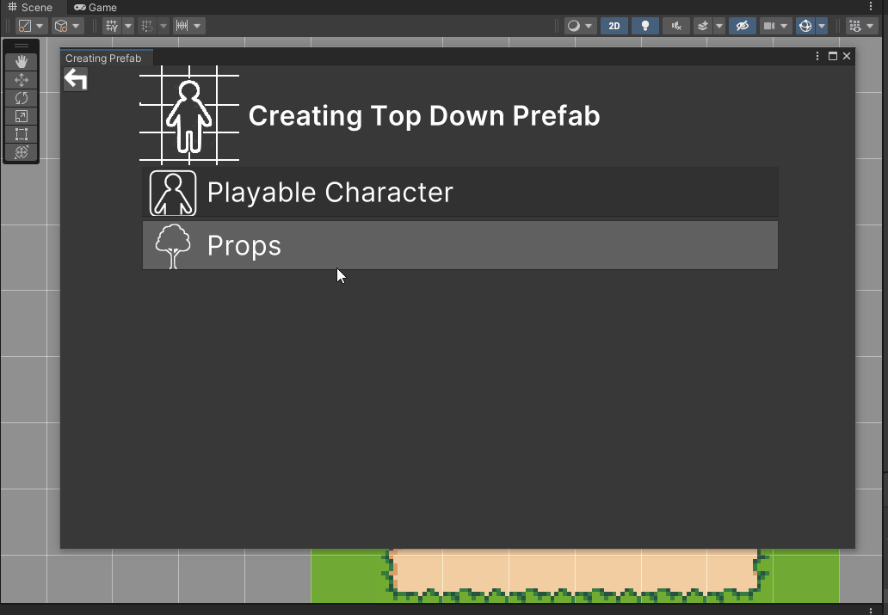
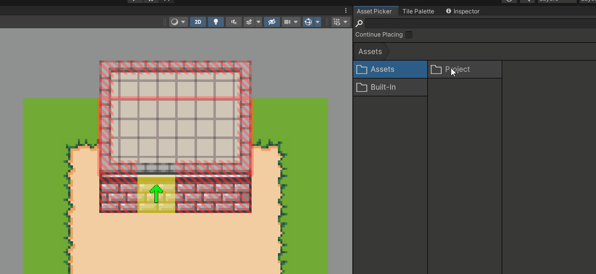

# Prefab creation

This section covers the **Creation of prefabs** with **RPG Power Forge**

> 🐞 [Bug tracker here](https://trello.com/b/PIzgsYov/rpg-power-forge-road-map)

---
## Window location

The **About** window is located here : 

## Window content

Currently, you can create **Top-Down** prefabs. Select **[Top Down]** :

You can choose between :
* Creation of a new **playable character**
* Creation of a so called **"props"** (object, tree, ...) with a small hit-box.

## Playable Character

You should **[import some animations first](./import_spritesheet.md)** !

### Animations auto-fill

To create a playable character, you will have to select an **Animation Collection**. **RPG Power Forge** will try to fill animations automatically for your character based on the following :

Animation filename contains|Result
---|---
"idle" | Will be assigned to the **Idle** animation
"walk" | Will be assigned to the **Walk** animation
"run" | Will be assigned to the **Run** animation
... | ...

Animation filename contains|Result
---|---
"up" | Will be assigned to the **Up direction** of the animation
"down" | Will be assigned to the **Down direction** of the animation
"right" | Will be assigned to the **Right direction** of the animation
"left" |Will be assigned to the **Left direction** of the animation
"down" + "left" |Will be assigned to the **Down Left direction** of the animation
... | ...

For example, the animation named *"idle_up"* will be automatically assigned to the **Idle animation** (**Up direction**) of the character. You can edit **Animation Collection** to change the naming if necessary before creating your playable character : 

### Create the playable character

### Edit the playable character

You can see how the animations have been automatically filled in the Prefab edition window :

> 🐲 Don't forget to edit the following properties !

Property|Value
---|---
Acceleration | 100
Deceleration | 100
Velocity | 5

### Assign the playable character

Drag-and-drop your newly created prefab in the following field :

## Props and other objects

> 🐲 **[Import more sprites](./import_sprites.md)** and make prefabs of them !

## Drag-and-drop prefabs

> 🐲 Use the **[Asset picker](./place_props.md)** for more !