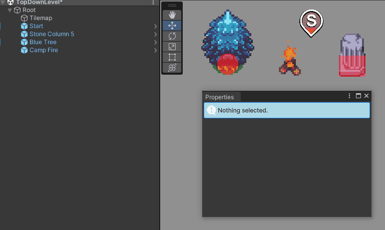
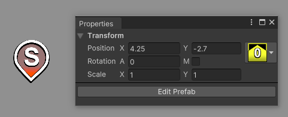
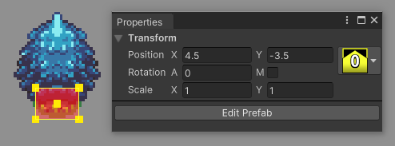
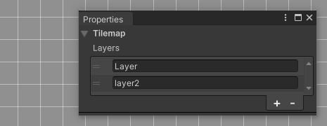

# **Properties**

This section covers the **Properties** window of **RPG Power Forge**. This window helps your to set various parameters easily.

> 🐞 [Bug tracker here](https://trello.com/b/PIzgsYov/rpg-power-forge-road-map)

## **Window location**

The **Properties** window is located here : 

## **Select an object**
The window adapt it's content depending on your current selection (either from the hierarchy or select tool) !

## **Window content**

The **Properties** window is meant to simplify the editing process of an object on the Scene. Here are the differents content depending on the selected object :

### **Start position**

### **Prefab instance**

### **Tilemap**

