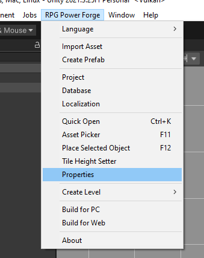
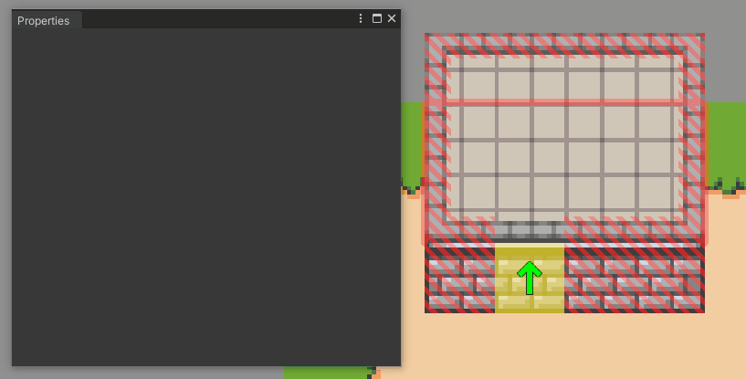

# Properties

This section covers the **Properties** window of **RPG Power Forge**

> 🐞 [Bug tracker here](https://trello.com/b/PIzgsYov/rpg-power-forge-road-map)

---
## Window location

The **Properties** window is located here : 

## Window content

The **Properties** window is meant to simplify the editing process of an object on the Scene. For example, the below sample shows how to change the height of an object in one click. 

> 🐲 ~= Unity **Inspector** window, but simpler and specifically oriented for RPG games.