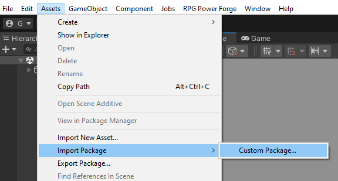
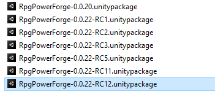
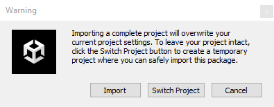
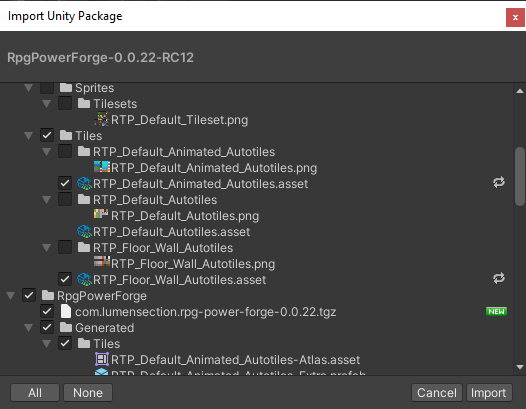

# Update RPG Power Forge

This section covers the update of the **RPG Power Forge** package in your Unity project. 

> 🐞 [Bug tracker here](https://trello.com/b/PIzgsYov/rpg-power-forge-road-map)

---
## Open your Unity project

To update **RPG Power Forge** package, navigate the top-menu : *Assets > Import Package > Custom Package...*

The file explorer menu opens, prompting you to select a **.unitypackage** file. Select the **RPG Power Forge** version you want to update to (in this example we will take 0.0.22RC12):

Once selected, a Unity pop-up will warn you about the upcoming import. It is perfectly normal as **RPG Power Forge** is rightfully considered a "complete project" by Unity. Select **[Import]**.

Unity is now listing the files that will be imported in the process. Since you are updating **RPG Power Forge** version, not all of the files have changed, so it's normal if some are not selected. Select **[Import]**.

Once the import process is done, **RPG Power Forge** may ask you to restart Unity. Select **[Install]**.

Congratulation, **RPG Power Forge** is now updated ! You can make sure about your version in the **[About](./about.md)** window.